# DESIGN.md — kanban.page

Especificación **completa** del sistema de diseño actual. Toda feature UI nueva debe cumplirla. Si algo no está aquí, no está definido — amplía este documento en el mismo PR.

**Fuente de verdad en código:** `styles.css`, `index.html`, `app.js`, `kuiper-ui.js`, `kuiper-issue-panel.js`.

| Documento | Rol |
| --- | --- |
| [`docs/design-brief.md`](docs/design-brief.md) | Intención de producto, decisiones cerradas, motion resumido |
| [`docs/kuiper-architecture.md`](docs/kuiper-architecture.md) | SQLite, API, `?kuiper=1` |
| [`docs/i18n-spec.md`](docs/i18n-spec.md) | Internacionalización |
| [`CLAUDE.md`](CLAUDE.md) | Arquitectura y reglas de dominio |

**Jerarquía de conflictos:** tokens/clases → `styles.css`; comportamiento visual → este doc; reglas de negocio → README / `CLAUDE.md`.

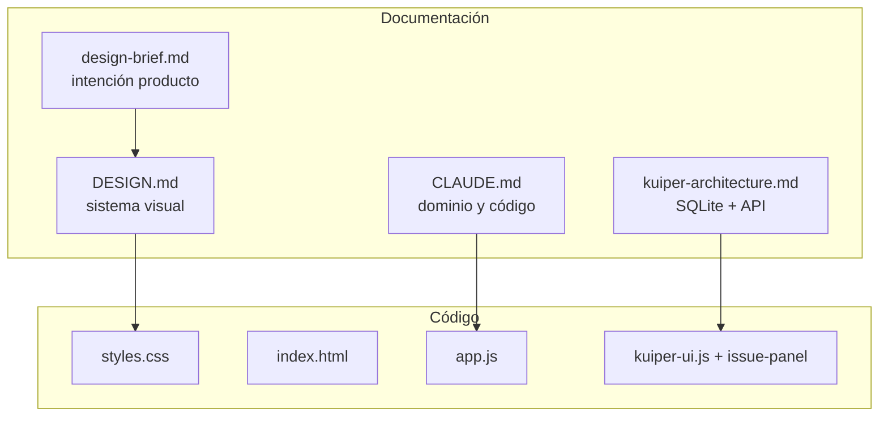

---

## 1. Principios

### 1.1 Voz tipográfica

| Voz | Token | Stack | Uso obligatorio |
| --- | --- | --- | --- |
| Humana | `--ui` | `"Avenir Next", Avenir, -apple-system, system-ui, sans-serif` | Títulos, notas, copy, botones `.primary`/`.ghost`, tabs issue |
| Máquina | `--mono` | `"SF Mono", ui-monospace, SFMono-Regular, Menlo, monospace` | Etapas, contadores, fechas, IDs `kb…`, sesiones, semanas, labels `.lbl`, meta tarjeta |

**Prohibido:** mono en párrafos o botones CTA salvo patrones existentes (`.seg`, `.wk`, `.chip`, `.cmd-input input`).

### 1.2 Color semántico

| Rol | Token / valor | Uso |
| --- | --- | --- |
| Fondo app | `--bg` | `body`, scrim base |
| Superficie elevada | `--surface` | Tarjetas, sheets, menús |
| Recess / campos | `--raise`, `--raise-hi` | Inputs inactivos, hover pills |
| Borde | `--line`, `--line-hi` | Contornos; hover/focus |
| Texto | `--text` → `--muted` → `--faint` | Jerarquía descendente |
| Acento | `--accent-fill` + `--accent-ink` | CTA, etapa activa, ticks, cursor marca, flag activo |
| Acento tenue | `--accent-dim`, `--accent-wash` | Copiado, opciones sync destacadas |
| Peligro | `--danger` | Delete, parar timer, menú delete, `.ghost.danger` hover |
| Entidad | `--c` inline | Proyecto, épica, tag (ver §8) |
| Prioridad | `.kuiper-pri.p1`–`.p4` | Solo prioridad (ver §8.2) |

**Prohibido:** verde terminal, serif editorial, nuevos acentos sin token.

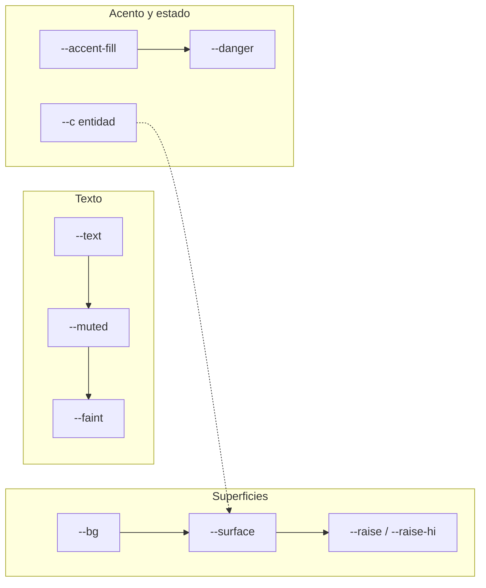

### 1.3 Densidad

| Modo | Atributo DOM | Atajo | Efecto |
| --- | --- | --- | --- |
| Cómodo | *(ausente)* | — | Default |
| Compacto | `html[data-density="compact"]` | `D` | `--col-w: 264px`, `--col-min: 248px`; menos padding tarjeta; notas 1 línea; chips más bajos |

No reducir tamaño del meta mono en compacto.

### 1.4 Tema

| Modo | Atributo | `theme-color` meta |
| --- | --- | --- |
| Claro | `html[data-theme="light"]` | `#F1F0F5` |
| Oscuro | `html[data-theme="dark"]` | `#131218` (Kuiper local) / `#14131A` |

Toggle: menú `T` o prefs Kuiper. Kuiper local default: **dark** si no hay preferencia.

---

## 2. Tokens CSS (valores exactos)

### 2.1 Superficies y texto

| Token | Light | Dark |
| --- | --- | --- |
| `--bg` | `#F1F0F5` | `#14131A` |
| `--surface` | `#FFFFFF` | `#1C1B24` |
| `--raise` | `#F4F3F8` | `#23222D` |
| `--raise-hi` | `#EBE9F2` | `#2A2835` |
| `--line` | `#E3E1EB` | `#2E2C3A` |
| `--line-hi` | `#C8C5D5` | `#413E51` |
| `--text` | `#191722` | `#EFECF4` |
| `--muted` | `#6B6779` | `#9A94A8` |
| `--faint` | `#96919F` | `#6A6579` |

### 2.2 Acento

| Token | Light | Dark |
| --- | --- | --- |
| `--accent` | `#C07310` | `#FFB454` |
| `--accent-fill` | `#F0A93C` | `#FFB454` |
| `--accent-ink` | `#2B1C05` | `#1A1206` |
| `--accent-dim` | `#E8CBA0` | `#6E5027` |
| `--accent-wash` | `#FBF1E2` | `#2A2113` |

### 2.3 Semánticos

| Token | Light | Dark |
| --- | --- | --- |
| `--danger` | `#C93B58` | `#F0728C` |

### 2.4 Sombras

```css
--sh-1: 0 1px 2px rgba(28,24,42,.05), 0 8px 20px -16px rgba(28,24,42,.4);          /* light */
--sh-2: 0 20px 50px -20px rgba(28,24,42,.26), 0 2px 8px rgba(28,24,42,.06);
--sh-drag: 0 26px 55px -18px rgba(28,24,42,.32), 0 4px 12px rgba(28,24,42,.1);
/* dark: mismas estructuras con alphas más altos — ver styles.css */
```

### 2.5 Layout

| Token | Valor |
| --- | --- |
| `--col-w` | `300px` (264px compact) |
| `--col-min` | `272px` (248px compact) |
| `--r` | `10px` |
| `--ease` | `cubic-bezier(.2,.8,.25,1)` |
| `--ui` / `--mono` | ver §1.1 |

### 2.6 Atributos `html`

| Atributo | Valores | Efecto |
| --- | --- | --- |
| `data-theme` | `light` \| `dark` | Paleta |
| `data-density` | `compact` | Densidad |
| `data-kuiper` | `1` | Estilos tablero Kuiper |
| `data-kuiper-side` | `open` | Sidebar abierto |
| `lang` | `en` \| `es` | i18n |

---

## 3. Tipografía (escala completa)

| Elemento | Selector | font | size / weight | line-height | tracking | transform |
| --- | --- | --- | --- | --- | --- | --- |
| Body | `body` | ui | 14px 400 | — | — | — |
| Título tarjeta | `.card h3` | ui | 14px 500 | 1.38 | −0.005em | — |
| Título compact | `[data-density="compact"] .card h3` | ui | 13px 500 | 1.3 | — | — |
| Título editor | `.f-title` | ui | 21px 500 | 1.3 | −0.015em | — |
| Notas tarjeta | `.card .note` | ui | 12.5px 400 | 1.45 | — | clamp 2 |
| Notas editor | `.f-notes`, `.kuiper-md` | ui | 13px 400 | 1.5–1.62 | — | — |
| Cabecera columna | `.col-name` | mono | 10.5px 500 | 1 | 0.19em | uppercase |
| Contador | `.col-count` | mono | 10.5px 400 | 1 | — | — |
| Meta tarjeta | `.card .meta` | mono | 10.5px 400 | 1 | 0.04em | — |
| Proyecto en meta | `.card .meta .proj` | ui | 11px 500 | 1 | 0 | — |
| Label campo | `.field .lbl` | mono | 10.5px 400 | 1 | 0.15em | uppercase; width 62px |
| Label Kuiper | `.kuiper-ed-lbl` | mono | 10px 400 | 1 | 0.12em | uppercase |
| Pill filtro | `.pill` | ui | 12px 500 | 1 | 0.01em | height 27px |
| Primary | `.primary` | ui | 13px 600 | 1 | 0.01em | height 34px |
| Primary sm | `.primary.sm` | ui | 12px 600 | 1 | — | height 30px |
| Ghost | `.ghost` | ui | 13px 500 | 1 | — | height 34px |
| Ghost sm | `.ghost.sm` | ui | 12px 500 | 1 | — | height 26px |
| Seg etapa | `.seg button` | mono | 10.5px 500 | 1 | 0.15em | uppercase |
| Panel title | `.panel-head h2` | mono | 11px 500 | 1 | 0.19em | uppercase |
| Menú fila | `.menu button` | ui | 13px 400 | 1 | — | — |
| Toast | `.toast` | ui | 12.5px 400 | 1.35 | — | — |
| Semana informe | `.wk` | mono | 15px 500 | 1.3 | 0.06em | uppercase |
| Resumen informe | `.rep-sum` | mono | 10.5px 400 | 1 | 0.12em | uppercase |
| Fila informe título | `.rep-row .rt` | ui | 13.5px 400 | 1.35 | — | — |
| Ruta informe | `.rep-row .rf` | mono | 10.5px 400 | 1 | 0.08em | uppercase |
| Timer | `.kuiper-time-display` | mono | 22px 600 | 1 | 0.06em | center |
| ID tarjeta | `.kuiper-card-id` | mono | 10–11px 400 | 1 | 0.02em | — |
| Tab issue | `.kuiper-issue-tab` | ui | 11px 500 | 1 | 0.04em | uppercase |
| Empty | `.kuiper-panel-empty`, `.kuiper-linked-empty` | ui | 11–12px 400 italic | 1.4 | — | — |
| kbd atajo | `kbd` | mono | 10px 500 | 1 | — | — |

---

## 4. Geometría y espaciado

| Elemento | Medida |
| --- | --- |
| Rail altura | `calc(52px + env(safe-area-inset-top))` |
| Board altura | `calc(100dvh - 52px - safe-area-inset-top)` |
| Gap columnas | 14px (10px ≤640px) |
| Board padding | `18px 16px 20px` (móvil `14px 10px`) |
| Columna max-width (estándar) | 420px |
| Columna Kuiper (no swimlane) | `flex: 1 1 0; min-width: var(--col-min); max-width: none` |
| Padding tarjeta | `11px 12px 11px 14px` |
| Borde tarjeta | 1px `var(--line)`, radius `var(--r)` |
| Borde proyecto | `.edge` 2px left, top/bottom inset 11px |
| Sheet ancho default | `min(560px, calc(100vw - 32px))` |
| Sheet ancho informe | `min(680px, calc(100vw - 32px))` |
| Sheet Kuiper editor | `min(960px, calc(100vw - 28px))` |
| Sheet top (desktop) | `12vh` (informe `9vh`) |
| Sheet radius | 16px (móvil bottom sheet: `16px 16px 0 0`) |
| Panel derecho | `min(340px, 92vw)` |
| Sidebar Kuiper | `min(300px, 90vw)` |
| Aside editor | 248px fijo |
| Input radius | 8px |
| Menú radius | 12px; items 7px |
| Icon | 30×30; `.sm` 26×26 |
| Touch target | 44×44 en `pointer: coarse` |
| Chip sesión padding | `6px 7px`, radius 6px |
| Phantom altura | 46px |

### 4.1 Layout Workbench (pantalla principal)

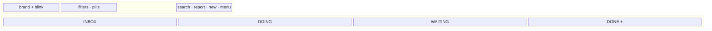

Overlays (sheet / panel) se superponen al board; no reducen su ancho.

---

## 5. Capas z-index

| z-index | Elemento |
| --- | --- |
| 20 | `.rail` |
| 90 | `.scrim` |
| 100 | `.sheet`, `.panel`, `.kuiper-side` |
| 110 | `.menu` |
| 120 | `.toast` |
| 140 | `.kuiper-delete-dlg` |
| 200 | `.card-ghost-wrap` |
| 300 | `.col-ghost-wrap` |
| 400 | `.update-notice` |

Dropdowns Kuiper: menús portaled a `body` cuando hace falta; `z-index` hereda de `.menu`.

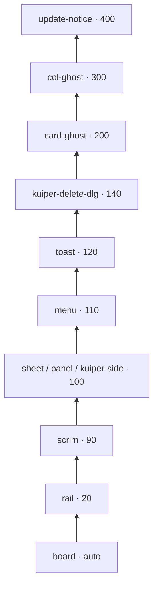

---

## 6. Duraciones y easing

| Duración | Uso |
| --- | --- |
| 120ms | Blur tag suggest close |
| 140ms | `.rep-row` hover, `.rep-row .rd` |
| 160ms | Hover icon/pill, `menuIn`, panel color |
| 180ms | `fade` scrim, border transitions, `panelIn` translate |
| 190ms | Ghost drop settle (JS `animate`) |
| 200ms | `pillIn`, col hover grab |
| 220ms | `composer` cardIn |
| 240ms | `cardIn`, `sheetIn` |
| 260ms | FLIP cards, `toastIn`, `.kuiper-side` slide |
| 760ms | `wash` copy chip |
| 1200ms | Revert copied state (chip, cmd-input) |
| 2600ms | `kuiper-discard-pulse` cycle |
| 3200ms | `ARM_MS` delete confirm en archivo |

Easing global: `var(--ease)` / `EASE` en JS.

---

## 7. Componentes — modo estándar (upstream)

### 7.1 Rail `.rail`

Estructura: `.brand` + `.filters` + `.tools`.

- **Marca:** `.brand` + `.blink` (6×13px, animación `blink` 1.15s steps).
- **Filtros:** `.pill` con `.dot` (`--c` proyecto); `[aria-pressed="true"]` activo; `.pill.flagpill` para destacadas; `.pill.add` para nuevo proyecto.
- **Búsqueda:** `.search` 122px → 210px en `:focus-within` (móvil: icono 44px, expande a 190px).
- **Herramientas:** `#reportBtn`, `#newTask`, `#menuBtn` como `.icon`.

### 7.2 Tablero

- **`.board`:** flex horizontal, `scroll-snap-type: x proximity`; `.dragging` desactiva snap.
- **`.col`:** flex column; head 30px (44px touch); body scroll con scrollbar 8px.
- **`.col-body.over`:** tint `color-mix(raise 55%)` al arrastrar encima.
- **`.col.ghost-col`:** 22px; `.add-col` opacity 0 → 0.5 on board hover.
- **`.card`:** shadow `--sh-1`, hover `--sh-2`; cursor grab.
- **`.composer`:** borde `--line-hi`, animación entrada.
- **`.phantom`:** slot vacío + `.tcursor` (7×15px ámbar).

### 7.3 Drag de tarjeta

| Parámetro | Valor |
| --- | --- |
| Umbral mouse | 5px |
| Umbral touch cancel | 8px antes de hold |
| Hold touch | 320ms |
| Ghost scale | 1.02 (`.card-ghost.lift`) |
| Tilt máximo | ±4.5° (`vx * 0.25`) |
| Drop animation | 190ms a rect destino |
| FLIP | 260ms, stagger `min(45, 260/(n+1))` ms |

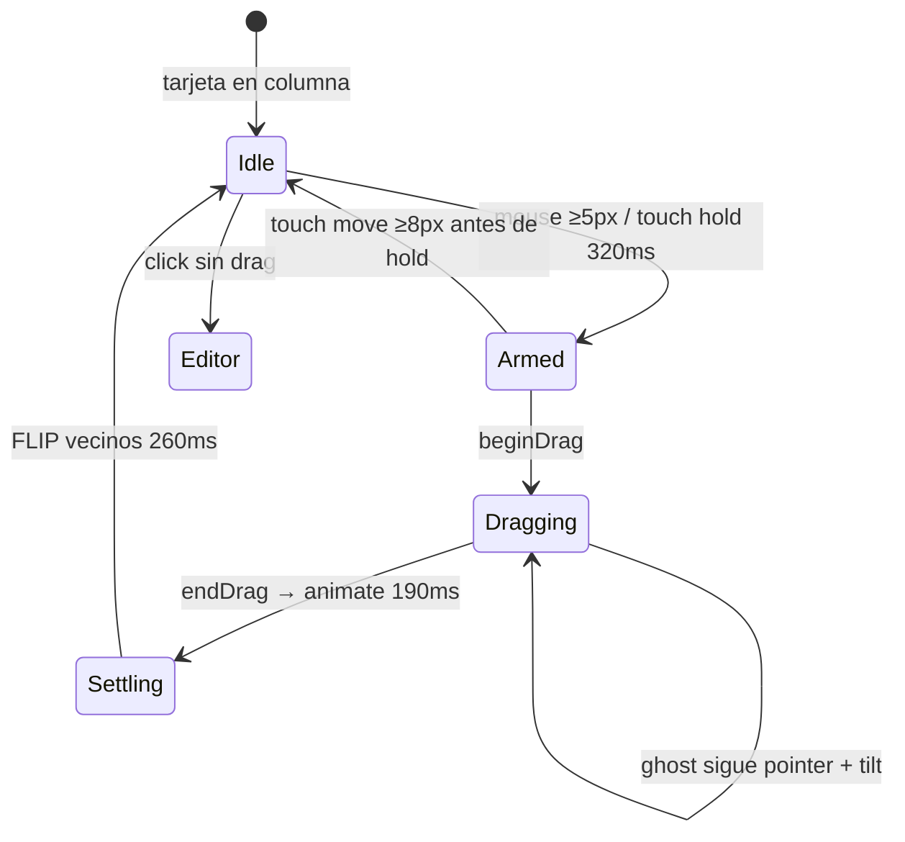

### 7.4 Copiar sesión

1. Click `.chip` → clase `.copied`, sweep `wash` 760ms.
2. Revertir a 1200ms.
3. Borde chip: `--accent-dim`; fondo wash `--accent-wash`.

### 7.5 Overlays

**Scrim:** `color-mix(bg 62%)`, `backdrop-filter: blur(3px)`, `fade` 180ms.

**Sheet:** centrado `translateX(-50%)`; móvil anclado abajo `max-height: 92dvh`.

**Panel:** slide desde derecha; head 52px.

### 7.6 Botones (catálogo)

| Clase | Dimensiones | Fondo | Texto |
| --- | --- | --- | --- |
| `.primary` | h 34, px 18, r 999px | `--accent-fill` | `--accent-ink` |
| `.primary:hover` | — | `filter: brightness(1.08)` | — |
| `.primary:active` | `scale(.97)` | — | — |
| `.ghost` | h 34, px 13 | transparent | `--faint` → hover `--text` on `--raise` |
| `.ghost.danger:hover` | — | mix danger 12% | `--danger` |
| `.ghost.danger.armed` | — | mix danger 12% | `--danger` |
| `.icon` | 30×30, r 999px | hover `--raise` | `--muted` |
| `.flagbtn` | 32×32 | igual icon | pressed `--accent-fill` |

### 7.7 Campos editor clásico

| Campo | Clases | Comportamiento |
| --- | --- | --- |
| Título | `.f-title` | Sin borde; focus `inset box-shadow` línea |
| Notas | `.f-notes` | Fondo `--raise`, focus `--bg` + borde `--line-hi` |
| Etapa | `.seg` + buttons `[aria-pressed]` | Activo: `--accent-fill` / `--accent-ink` |
| Proyecto/épica/prioridad | `.field` + `.chooser` + `.pill` | Pills toggle `aria-pressed` |
| Sesión | `.cmd-input` | Mono input; `.copied` en wrap |

### 7.8 Menú `.menu`

- Posición: `top: 50px; right: 14px` (móvil `right: 10px`).
- `min-width: 208px`; padding 6px.
- Separadores: `hr` con margin `5px 8px`.
- Labels sección: `.menu-label` mono uppercase.
- Toggles: `.tick` ámbar visible si `[aria-pressed="true"]` o `aria-checked`.

### 7.9 Toast `.toast`

- Bottom `24px + safe-area`; max-width `min(calc(100vw - 24px), 420px)`.
- Botón undo: pill `--raise` → hover `--accent-fill`.

### 7.10 Informe semanal

| Parte | Clase | Notas |
| --- | --- | --- |
| Cabecera | `.rep-head` | `.wk` selector semana |
| Cuerpo | `.rep-body` | max-height `min(54vh, 440px)` |
| Tense | `.rep-tense` | SHIPPED / IN FLIGHT headings |
| Fila | `.rep-row` | `.tick`, `.rt`, `.rf`, `.rp`, `.rd` |
| Tick on | `.rep-row.on .tick` | fill `--accent-fill` |
| Fecha override | `.rep-row input[type="date"]` | borde `--accent-dim` |
| Footer | `.sheet-foot` | select all, count, copy, download |

Móvil: ocultar ruta `.rf` en filas (CSS comentado en stylesheet).

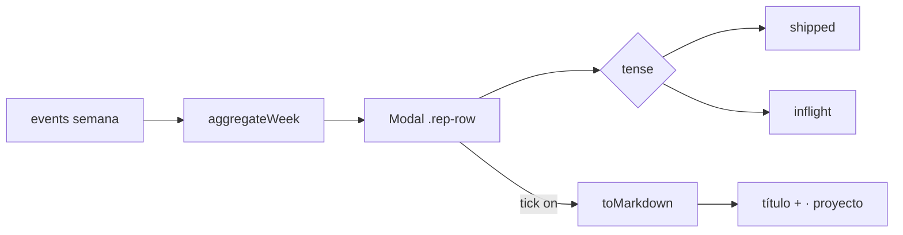

### 7.11 Proyectos `.prow`

- Swatch 12px: abre `.palette` de 8 botones 15px.
- Delete fila: `.icon` hover `--danger`, opacity 0 hasta hover.
- Colores: ver §8.1 + `COLOR_NAMES`.

### 7.12 Archivo `.arow`

- Layout: `.edge` + `.atext` + botones `.ghost.sm`.
- Restore / Delete: opacity 0 hasta row hover; touch siempre parcialmente visible.
- Delete all: `#arch-empty.armed` tras primer click; timeout **3200ms**.

### 7.13 Sync `#sync`

| Bloque | Clases | Notas |
| --- | --- | --- |
| Título estado | `.sync-state-title` | ui 16px 600 |
| Copy | `.sync-say`, `.sync-line` | `--muted` |
| Join | `.sync-join` + input mono | |
| Elección | `.sync-option` / `.secondary` | primario `--accent-wash` |
| QR | `.qr` | **siempre** fondo `#FFF`, módulos `#14131A` |
| Par link | `.sync-pair` | flex; móvil columna |
| Acciones | `.sync-action.danger` | strong `--danger` |
| CLI | `.sync-cli` | `details`; cmd en `.sync-cli-cmd` mono |

### 7.14 Update notice

Esquina inferior derecha; botón update `--accent-fill`.

---

## 8. Colores de entidad

### 8.1 Paleta de 8 (proyectos, épicas, tags)

Definida en `app.js` (`COLORS`) y `kuiper-ui.js` (`ENTITY_COLORS`) — **deben mantenerse sincronizadas** con `server/board-view.js`.

| Índice | Hex | Nombre (`COLOR_NAMES`) |
| --- | --- | --- |
| 0 | `#FFB454` | Amber |
| 1 | `#7FD1AE` | Mint |
| 2 | `#8FB8FF` | Sky |
| 3 | `#F58FA8` | Rose |
| 4 | `#C79BFF` | Violet |
| 5 | `#6FD3E8` | Cyan |
| 6 | `#D6C36B` | Gold |
| 7 | `#9AA5B8` | Slate |

**Asignación:**

- Proyecto: índice en lista de proyectos del tablero.
- Épica: `epic.color` o índice en lista filtrada.
- Tag: `hash(nombre) % 8`.

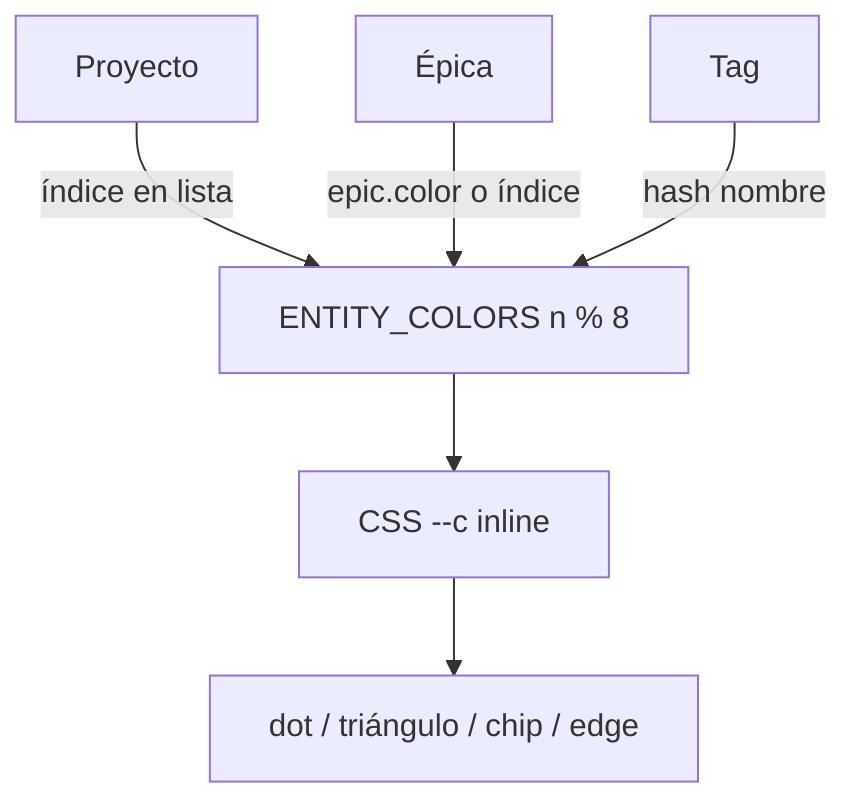

**CSS tag chip:**

```css
background: color-mix(in srgb, var(--c) 16%, var(--surface));
color: var(--c);
border: 1px solid color-mix(in srgb, var(--c) 35%, var(--line));
```

### 8.2 Prioridad

| Nivel | Clave i18n | Color | SVG |
| --- | --- | --- | --- |
| 0 | `priorityNone` | — | oculto |
| 1 | `priorityLow` | `#6b9bd1` | chevron abajo |
| 2 | `priorityMedium` | `#d4a72c` | 1 chevron arriba |
| 3 | `priorityHigh` | `#e07a2f` | 2 chevrones |
| 4 | `priorityCritical` | `#e5484d` | 3 chevrones |

Clases: `.kuiper-pri.p{n}`, `.kuiper-pri-badge`, `.kuiper-pri-pill[aria-pressed="true"]`.

### 8.3 Marcas visuales

| Entidad | Marca |
| --- | --- |
| Proyecto | Círculo 6–7px `--c` |
| Épica | Triángulo `clip-path: polygon(50% 0%, 0% 100%, 100% 100%)` |
| Etapa done (enlace) | Checkbox `.kuiper-linked-status.done` verde `#7FD1AE` |

---

## 9. Iconografía

### 9.1 Set `app.js` (`ICON`)

`plus`, `more`, `close`, `copy`, `check`, `search`, `week`, `left`, `right`, `grip`, `star`, `starFill`.

### 9.2 Set `kuiper-ui.js` (`ICON`)

`side`, `more`, `close`, `chev`, `star`, `starFill`, `filter`, `copy`.

### 9.3 Issue panel

`DISCARD_ICON` — papelera 16×16 stroke en `kuiper-issue-panel.js`.

### 9.4 Reglas

- `viewBox="0 0 16 16"`.
- Stroke `currentColor`, width 1.3–1.8, `stroke-linecap="round"`.
- Tamaño render: 16px toolbar, 14px sm, 12px inline meta.

---

## 10. Modo Kuiper (`?kuiper=1&board=<slug>`)

### 10.1 Carga de scripts

Orden en `index.html`:

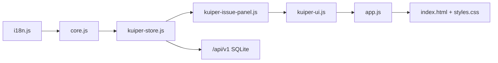

Query `?v=kuiper` en scripts. SW upstream se desregistra en Kuiper local.

### 10.2 Archivos y responsabilidades

| Archivo | Rol |
| --- | --- |
| `kuiper-store.js` | HTTP `/api/v1/*` |
| `kuiper-ui.js` | Sidebar, filtros, swimlanes, tarjetas, layout editor |
| `kuiper-issue-panel.js` | Tags, links, timer, tabs |
| `server/api/router.js` | API + `STATIC_FILES` |

### 10.3 Rail Kuiper

- `#kuiperSideToggle` — icono menú lateral.
- `.brand.kuiper-brand` — título tablero (ui 13px, no lowercase).
- Controles vista: agrupación, orden, filtros (`.kuiper-filters-wrap`).

### 10.4 Sidebar `.kuiper-side`

- Secciones: favoritos, árbol org/board, proyectos.
- Item: `.kuiper-item[aria-current="true"]` con `.tick` ámbar.
- Estrella favorito: `.kuiper-star[aria-pressed="true"]` → `--accent-fill`.

### 10.5 Swimlanes

Activar con agrupación ≠ `none`:

- `.board.kuiper-swimlanes` + `.kuiper-swimlanes-track` (CSS subgrid).
- `--stage-count` en track; gap 14px (10px móvil).
- Separador: `.kuiper-swimlane-sep` + `.kuiper-sep-label` + `.kuiper-sep-count`.
- Column body max-height: `min(340px, 42vh)`.

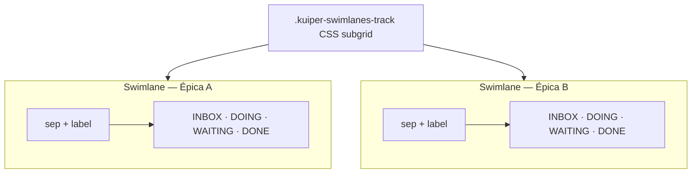

### 10.6 Tarjeta `.kuiper-card`

| Zona | Clases |
| --- | --- |
| ID | `.kuiper-card-id-wrap` > button copiar |
| Título | `h3` (padding extra si `.has-pri`) |
| Prioridad | `.kuiper-pri-badge` absolute top-right |
| Flag | desplazado si prioridad (`right: 34px`) |
| Pie | `.kuiper-card-foot` > `.kuiper-card-tags` + `.age` |
| Tag fila | `.kuiper-tag.proj` / `.epic` / `.label` — grid 52px + 1fr |

### 10.7 Dropdowns `.kuiper-ctrl`

- Botón: `.pill.kuiper-drop-btn` o `.kuiper-select-btn`.
- Menú: `.menu.kuiper-drop-menu`; items `[aria-selected="true"]` + tick.
- Cerrar al click fuera; `aria-expanded` en botón.

---

## 11. Editor de issue (Kuiper)

### 11.1 Dimensiones

| Propiedad | Valor |
| --- | --- |
| width | `min(960px, calc(100vw - 28px))` |
| min-height | `min(90vh, 860px)` |
| max-height | `min(96vh, 980px)` |
| top | `2vh` |
| aside width | 248px |
| main padding | `8px 22px 18px` |
| aside padding | `8px 14px 18px 12px` |
| tabs min-height | 160px; flex `1 1 38%` |
| notes min-height | 140px (flex `1 1 42%` en stack) |

### 11.2 Estructura DOM (orden final)

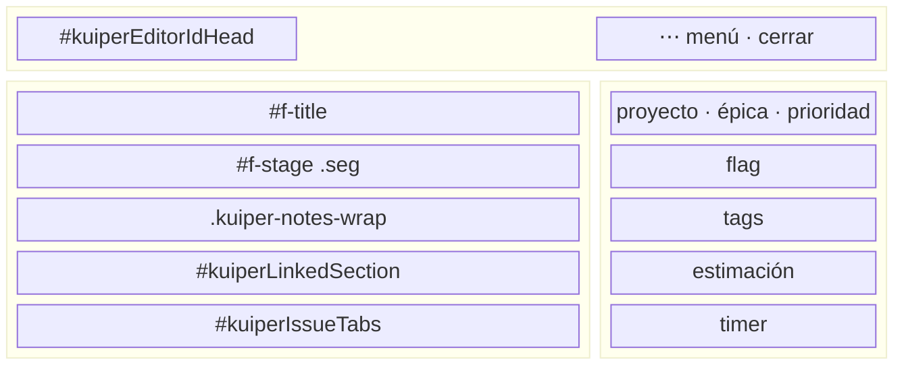

Orden vertical en **main:** notas → enlaces → tabs. Footer clásico `#f-save` / `#f-archive`: **hidden** en Kuiper; acciones en menú header.

### 11.3 Notas markdown

- Preview: `#f-notes-preview.kuiper-notes-preview`; click → edición.
- Vacío: `.md-empty` italic `--faint`.
- Render: `renderMarkdown()` → `.kuiper-md` con clases `.md-h1`…`.md-pre`, `.md-code`, `.md-ul`, `.md-hr`.
- Enlaces: `color: var(--accent)`, underline offset 2px.

### 11.4 Tags

- Input: `#kuiperTagInput` en `.kuiper-tag-editor`.
- Enter/comma añade; sugerencias `#kuiperTagSuggest` posición absolute.
- Eliminar: `.kuiper-tag-remove` × por chip.

### 11.5 Enlaces

| `linkKind` API | i18n | Semántica |
| --- | --- | --- |
| `blocks` | `linkKindBlocks` | Esta issue bloquea otra |
| `blockedBy` | `linkKindBlockedBy` | Bloqueada por otra |
| `related` | `linkKindRelated` | Relacionada |

UI: grupos separados; fila abre editor de la otra card; remove en hover.

### 11.6 Timer `.kuiper-time-tracker`

| Estado | UI |
| --- | --- |
| Idle | `#kuiperTimeIdle` — display muted, botón `.primary.kuiper-time-start` |
| Running | `#kuiperTimeRunning` — display activo, `.kuiper-time-actions` |
| Label | `#kuiperTimerLabel` **siempre visible** (fuera de idle/running toggle) |

**Parar:** `.kuiper-time-stop` — sólido danger, texto blanco.

**Descartar:** `.kuiper-time-discard` — dashed danger, icono papelera, pulso 2.6s; grid `1.12fr 1fr` con stop.

**Manual:** `#kuiperManualHours` + `#kuiperManualMins` + `.kuiper-time-add`.

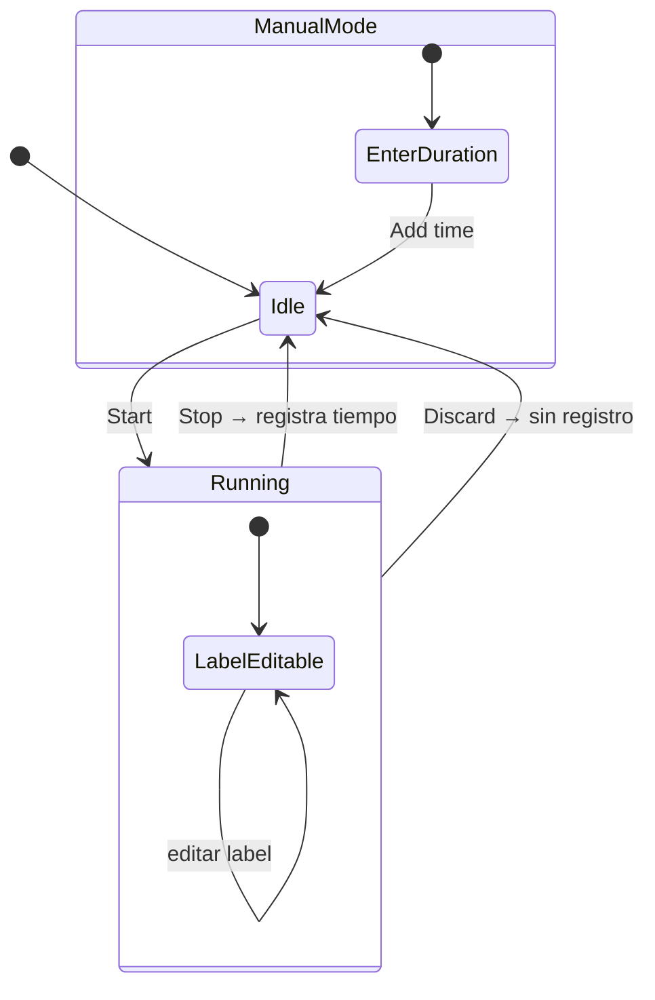

### 11.7 Tabs

| Tab `data-tab` | Panel | Contenido |
| --- | --- | --- |
| `comments` | `#kuiperCommentList` | form + lista |
| `time` | `#kuiperTimeLogList` | entradas manual/timer |
| `history` | `#kuiperHistoryList` | eventos (ver §11.8) |

Scroll: `.kuiper-issue-scroll.kuiper-scroll` — padding `11px 12px`, fondo `--raise`, focus `--bg`.

### 11.8 Historial (tipos de evento)

Claves i18n en `kuiper-issue-panel.js` → `hist*`:

`histCreated`, `histMoved`, `histArchived`, `histRestored`, `histUpdated`, `histTitleChanged`, `histNotesChanged`, `histPriorityChanged`, `histProjectChanged`, `histEpicChanged`, `histEstimateChanged`, `histTagsChanged`, `histCommentAdded`, `histTimeLogged`, `histTimerStarted`, `histTimerStopped`, `histTimerDiscarded`, `histLinkAdded`, `histLinkRemoved`.

### 11.9 Delete card

Diálogo `.kuiper-delete-dlg` → input confirmación título → `.kuiper-delete-actions .danger` pill rojo.

### 11.10 Responsive ≤760px

Grid 1 columna; aside debajo `max-height: 38vh`; main `overflow-y: auto`.

---

## 12. Scrollbars

| Clase | Comportamiento |
| --- | --- |
| `.scroll-quiet` | Oculta; al hover thin 2px `--faint` 35–38% |
| `.kuiper-scroll` / notes | `scrollbar-gutter: stable`; thin 3px; thumb transparent → faint 44% on hover |
| Column body desktop | 8px thumb `--line` |
| Swimlanes / board kuiper | scrollbars ocultos (`scrollbar-width: none`) |

---

## 13. Internacionalización

- Archivo: `i18n.js` — objetos `en`, `es`.
- Función: `tr(key, vars)` — `vars` para `{value}` en strings.
- DOM estático: `data-i18n`, `data-i18n-placeholder`.
- Kuiper panel: `KuiperIssuePanel.i18nPanel()` en `#kuiperIssueAsideExtras`, `#kuiperIssueTabs`, `#kuiperLinkedSection`.
- **Obligatorio:** cada string visible nueva en ambos idiomas.

---

## 14. Accesibilidad y input

### 14.1 Focus

- `:focus-visible` global outline 2px `--accent`, offset 2px, radius 6px.
- Excepción: `input`, `textarea`, `[contenteditable]` sin outline (borde propio).

### 14.2 Touch (`hover: none` / `pointer: coarse`)

Ver `styles.css` § input coarse — resumen:

- Controles ocultos en desktop → opacidad 0.4–0.55 en touch.
- Targets 44px: pills, icons, seg, menu, sheet-foot, etc.
- Inputs formulario 16px mínimo (iOS zoom).
- `touch-action: pan-x pan-y` en `.card`.
- Tap highlight transparente.

### 14.3 Reduced motion

`prefers-reduced-motion: reduce` → duraciones ~0.

### 14.4 `[hidden]`

`display: none !important` — usar siempre atributo `hidden`, no solo CSS.

---

## 15. Convenciones de implementación

### 15.1 CSS

1. Solo tokens + `color-mix(in srgb, …)`.
2. Bloques Kuiper tras comentario `/* Kuiper */` en `styles.css`.
3. Prefijo nuevas clases Kuiper: `kuiper-`.
4. Comentarios: explicar trade-offs, no repetir el selector.
5. Flex children con scroll: `min-height: 0` + `overflow-y: auto`.

### 15.2 JavaScript

1. Sin bundler; globals intencionados.
2. `esc()` en todo HTML interpolado.
3. Globals opcionales: `typeof KuiperIssuePanel !== 'undefined'` (no `KuiperIssuePanel?.fn` — ReferenceError).
4. Migraciones DOM idempotentes: `upgradeTimerLayout()`, `ensureEditorLayout()`, `ensureLayout()`.
5. `panelReady` / `editorLayoutReady` one-shot — cambios de estructura requieren reload o upgrade explícito.

### 15.3 `kanban serve`

Añadir a `STATIC_FILES` en `server/api/router.js`:

```
index.html, app.js, core.js, i18n.js, styles.css,
kuiper-store.js, kuiper-issue-panel.js, kuiper-ui.js,
manifest.webmanifest, sw.js, qr.js
```

Cache: `Cache-Control: no-cache` en estáticos locales.

---

## 16. Breakpoints y media queries

| Query | Efecto |
| --- | --- |
| `max-width: 640px` | Rail compacto; brand oculto (excepto `.kuiper-brand`); search icono; swimlanes sin ghost col |
| `max-width: 760px` | Editor Kuiper 1 columna |
| `min-width: 900px` | Sidebar empuja board; sin scrim |
| `hover: none` | Opacidades touch-safe |
| `hover: hover` | Hover pills/icons solo desktop |
| `pointer: coarse` | 44px targets, 16px inputs |
| `prefers-reduced-motion: reduce` | Sin animación |

---

## 17. Anti-patrones

| Prohibido | Correcto |
| --- | --- |
| Mono en body text | `--ui` |
| Hex sueltos para UI chrome | tokens |
| `datalist` para UX custom | dropdown posicionado |
| `optional chaining` en global no cargado | `typeof` guard |
| Dashed en drag placeholders | `--raise-hi` recess |
| Danger solo underline gris | botón `.kuiper-time-discard` o `.ghost.danger` |
| Párrafos explicativos en empty states | una línea `--faint` italic |
| QR invertido en dark | `.qr` siempre blanco |
| Animación decorativa continua | solo timer discard pulse |
| Omitir i18n es | claves en `en` + `es` |

---

## 18. Checklist PR (UI)

- [ ] Tokens y tipografía ui/mono correctos
- [ ] Light + dark verificados
- [ ] Touch: sin controles solo-hover
- [ ] `en` + `es`
- [ ] Clases `kuiper-*` si aplica
- [ ] Scroll flex con `min-height: 0`
- [ ] `STATIC_FILES` si hay asset nuevo
- [ ] `DESIGN.md` actualizado si introduces patrón nuevo
- [ ] Sin globals opcionales con `?.` sin guard

---

*Revisión: editor issue Kuiper, colaboración (tags, links, time, comments, history), swimlanes, timer con descartar. Mantener sincronizado con `styles.css`.*
