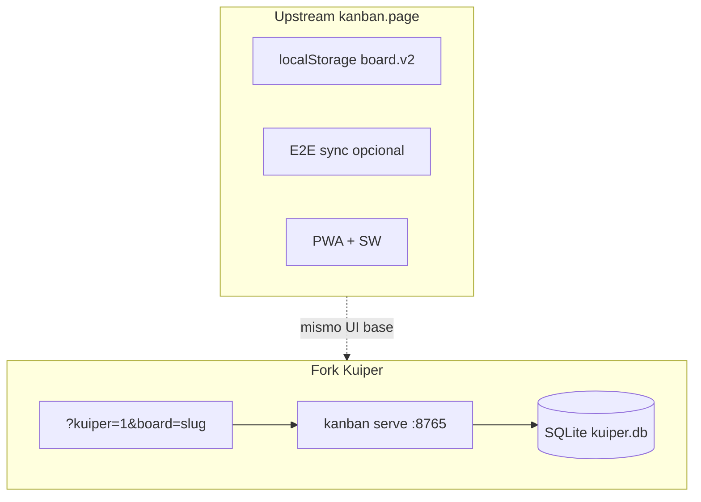
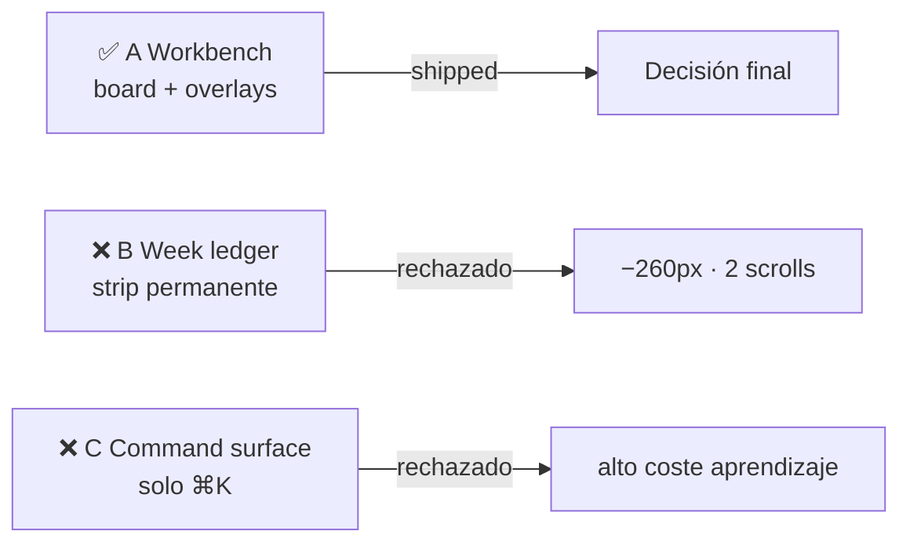
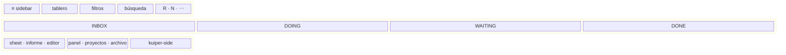
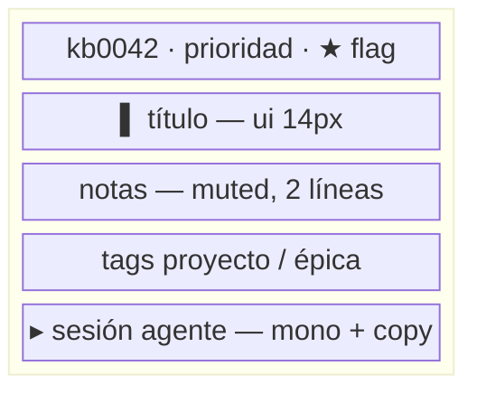
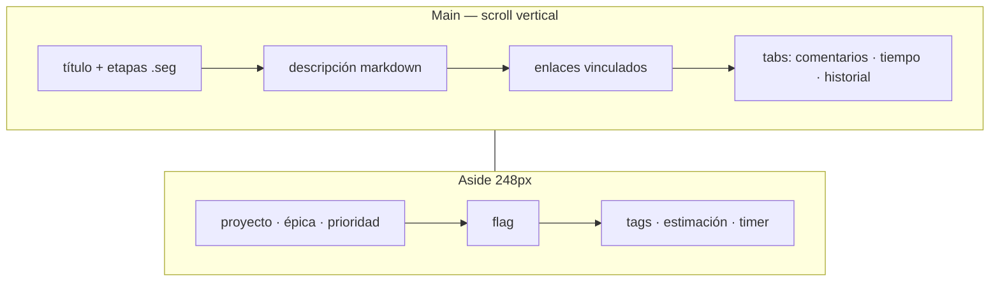
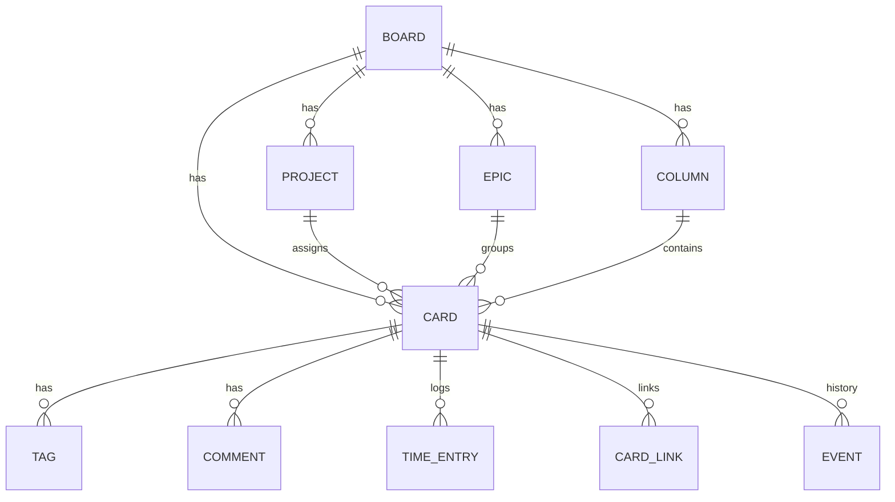
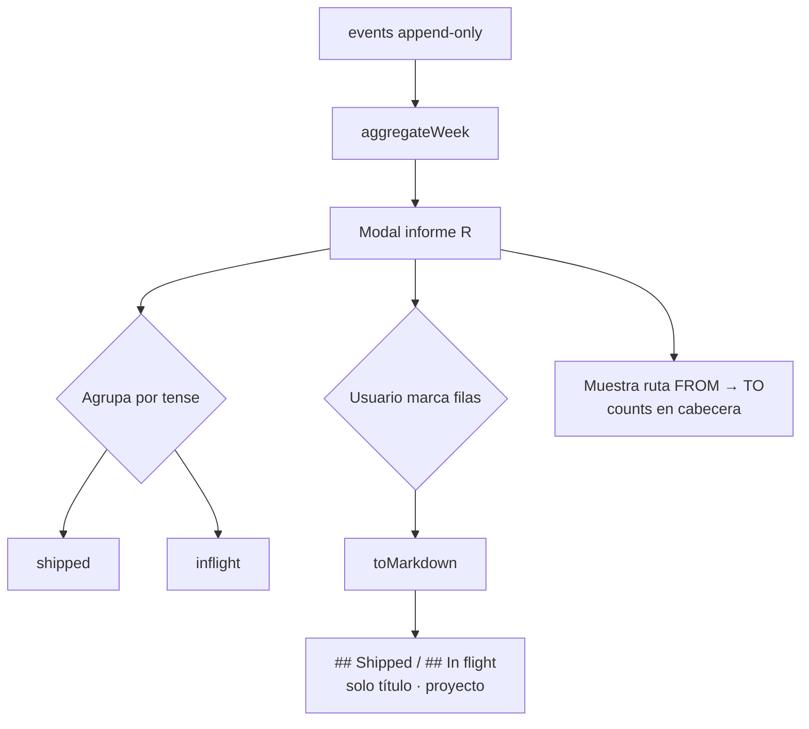
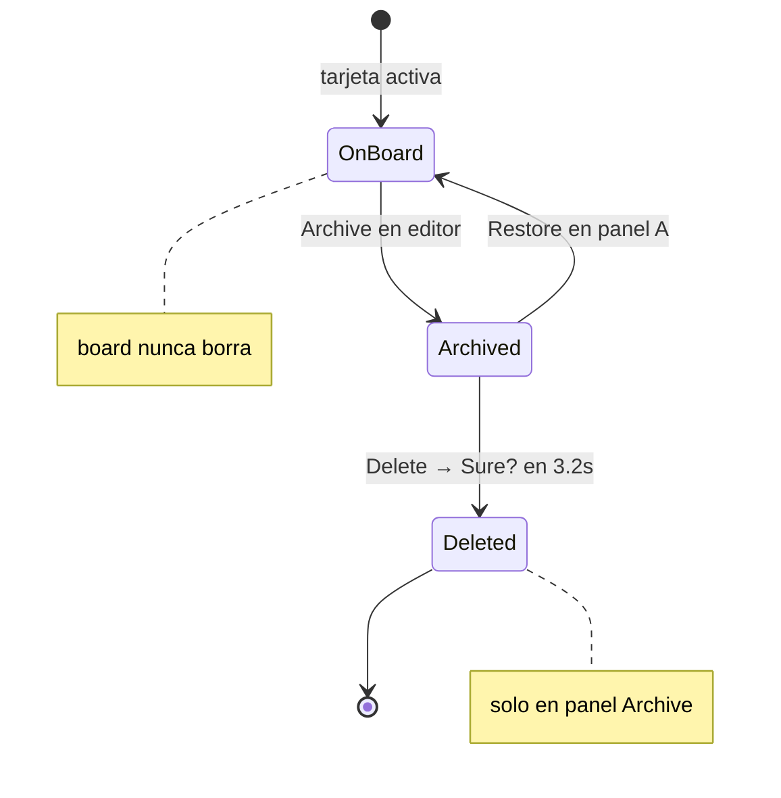
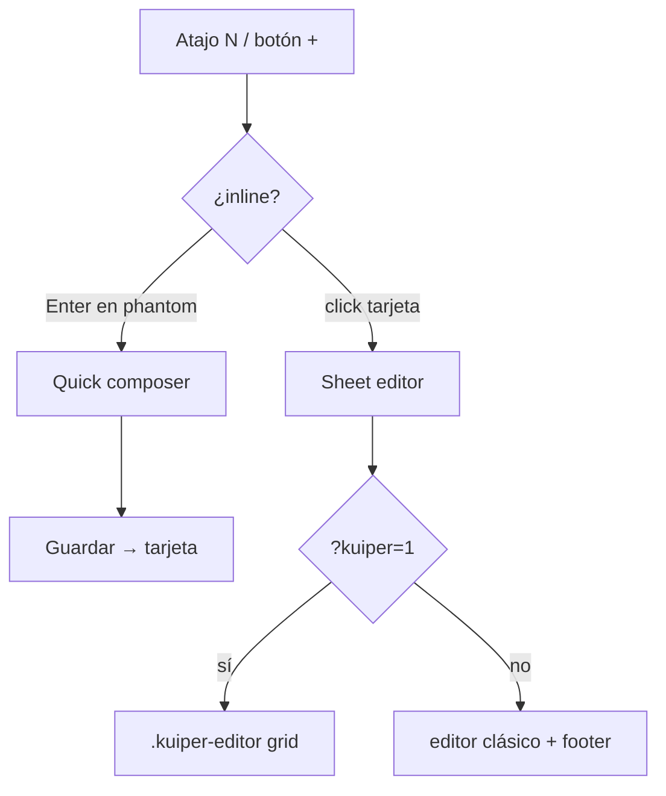
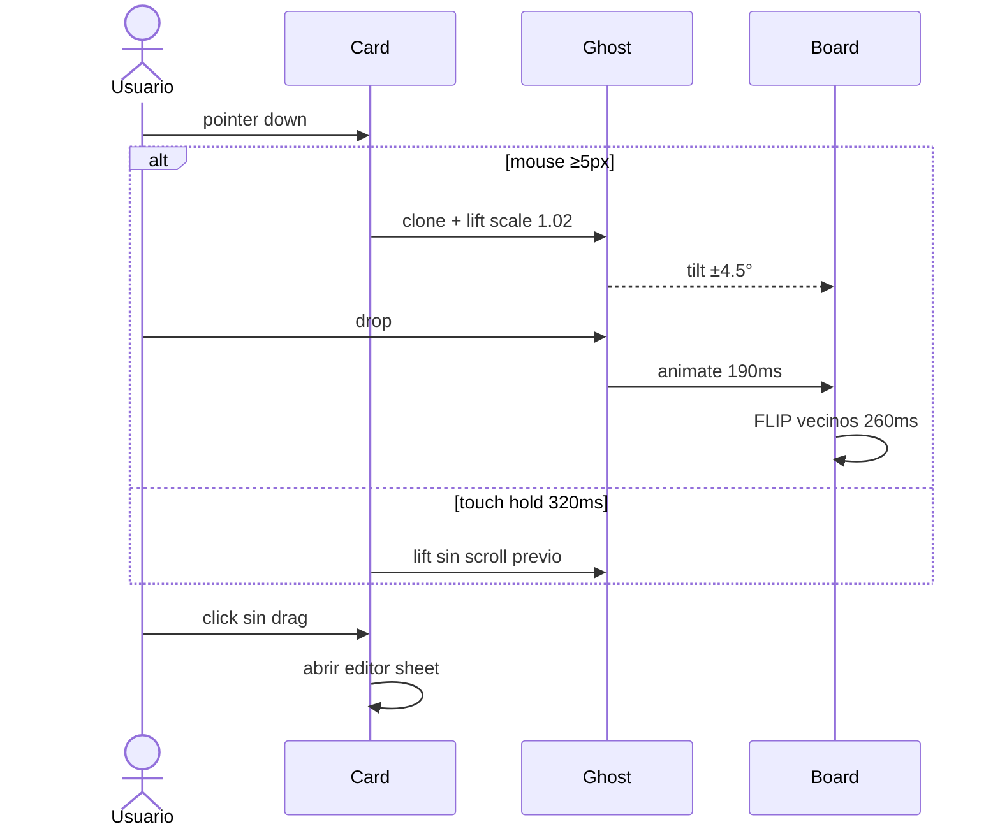

# board — design brief

> **Especificación visual y de componentes (canónica, actualizada):** [`design-system.md`](design-system.md)  
> **Fork Kuiper (SQLite, API, issue panel):** [`kuiper-architecture.md`](kuiper-architecture.md)

A personal kanban for developers who run AI coding agents (Claude Code, Codex) in the terminal. The upstream app ships as vanilla HTML/CSS/JS with optional E2E sync; the **Kuiper fork** adds local SQLite, stable issue IDs (`kb…`), and a full issue editor.

---

## Product intent (unchanged)

The defining artifact is not the card — it is the **resume command**. It comes from a terminal, is machine-generated, and is what gets the developer back into flight.

**Voice:** the machine speaks in **monospace** (stages, counts, sessions, dates, week ranges); the human speaks in **Avenir Next** (titles, notes). Mono always means “from the system.”

**Palette:** graphite with a violet cast, one accent — **amber** (terminal cursor). Project/epic/tag colors are the main extra chroma. Deliberately *not* near-black + acid green, *not* cream + serif.

**Aesthetic:** clean, minimal, intuitive motion — no long explanations in the UI.



---

## Hard requirements (original + current)

| # | Requirement | Status |
| --- | --- | --- |
| 1 | Browser app, vanilla HTML/CSS/JS, no build step | ✅ |
| 2 | Local-first storage | ✅ Upstream: `localStorage`. Kuiper: SQLite via `kanban serve` |
| 3 | Drag-and-drop between stages and within a column | ✅ Mouse: 5px move arms drag. Touch: 320ms hold, 8px move cancels |
| 4 | Session field with copy (`claude --resume …`) | ✅ `.chip` + amber sweep |
| 5 | Projects: add / rename / recolor / delete | ✅ Panel `P`, 8-color palette |
| 6 | Core kanban: CRUD, stages, filter, search, undo, backup | ✅ |
| 7 | Weekly report (America/Santiago, date override, partial export) | ✅ Modal `R`; export by tick |
| 8 | Minimal, animated, non-distracting UI | ✅ See [`design-system.md`](design-system.md) |
| 9 | *(added)* EN/ES interface | ✅ `i18n.js`, [`i18n-spec.md`](i18n-spec.md) |
| 10 | *(added)* Optional E2E sync between devices | ✅ `docs/sync.md` — not used in Kuiper local mode |
| 11 | *(added, Kuiper)* Issue IDs, epics, priority, tags, links, time, comments, history | ✅ `?kuiper=1` |

---

## Layout direction — resolved



### ✅ Direction A — “Workbench” (shipped)

Board is the whole screen. Report, editor, projects, archive, and sync are **overlays** (sheet / panel), not permanent chrome.



### ❌ Direction B — “Week ledger” (rejected)

Permanent week strip costs ~260px and a second scroll surface — conflicts with “no distractions.”

### ❌ Direction C — “Command surface” (rejected)

⌘K-only chrome raises learning cost — conflicts with “intuitive.”

---

## Card anatomy (upstream + Kuiper)



| Zona | Voz | Detalle |
| --- | --- | --- |
| ID + prioridad | mono | Esquina superior; flag se desplaza si hay prioridad |
| Copiar enlace | mono + icono | `.kuiper-card-id` — solo copia URL; no abre editor |
| Título | ui | `.card h3` |
| Notas | ui muted | clamp 2 líneas |
| Tags (Kuiper) | ui + `--c` | dot proyecto, triángulo épica |
| Sesión | mono | `.chip`, sweep ámbar 1.2s al copiar |
| Borde izq. | `--c` | 2px = color de proyecto |
| Tooltips | ui + `kbd` | `tooltip.js` sustituye `title` nativo |

---

## Kuiper issue editor (modal sheet)

Large sheet (`min(960px)`, ~90vh): **main** (título, etapas, descripción markdown, enlaces, tabs) + **aside** 248px (proyecto, épica, prioridad, flag, tags, estimación, timer).

- Enlaces estilo Jira bajo descripción, antes de tabs.
- Tabs: Comentarios | Registro de tiempo | Historial — botonera `.seg` (igual que etapas).
- Comentarios: formulario fijo arriba; lista con scroll; edición inline (lápiz → textarea → Save/Cancel); `PATCH` API.
- Timer en aside: estimación + barra progreso antes de Timer/Manual; registro manual con picker fecha/hora in-app.
- Footer clásico oculto; acciones en menú `⋯` del header.

Detalle completo: [`design-system.md` §11](design-system.md).



---

## Data model

### Upstream (`localStorage`, `board.v2` or `board.v2.<ns>`)

```js
{
  v: 2,
  theme: 'dark' | 'light',
  density: 'comfortable' | 'compact',
  locale: 'en' | 'es',              // also board.locale key globally
  asOf: null | 'YYYY-MM-DD',        // Chile calendar; null = today
  columns: [{ id, name }],          // order = stage order; rightmost = done
  projects: [{ id, name, color }],
  tasks: [{
    id, title, notes, projectId, session, flag,
    columnId, order, createdAt, updatedAt,
    archivedAt?, archivedFrom?,
  }],
  events: [{ id, taskId, title, type: 'created'|'moved', from, to, at, day }],
  filter: null | projectId,         // legacy single filter
  flagFilter: boolean,
  // + sync metadata when enabled (_contentGen, clocks, etc.) — see AGENTS.md / classic-board spec
}
```

### Kuiper (SQLite — see migrations)

Cards add: `priority` (0–4), `estimated_minutes`, `issue_number`, tags, comments, time entries, card links, event log for history. IDs stable `kb…` for Git branches. Board loaded via API; UI state (filters, group, sort, favorites) in `board.kuiper.prefs`.



---

## Events and report

`events` is append-only for the weekly report.

- `from` / `to`: **stage names as strings** at event time.
- `title`: snapshotted; report prefers live task title if it still exists.
- `at`: epoch ms — order within a day only.
- `day`: `YYYY-MM-DD` in **America/Santiago** — grouping key; override rewrites `day`, never `at`.

**Week math:** never raw epoch week boundaries — use `ymd`, `mondayOf`, `weekOf` in `core.js`.

**Modal vs export:**



- Modal: all created/moved cards; grouped by **tense** (`shipped` vs `inflight`); shows route `FROM → TO`; user **ticks** rows to export.
- Markdown export: **title only**, grouped in `## Shipped` / `## In flight`, optional ` · Project` suffix — no counts, no routes.

```markdown
# Progress — 10–16 Aug 2026

## Shipped
- Onboarding tour v2 · Website

## In flight
- Invoice PDF export · API
```

**Date override:** per-row control `.rep-row .rd` in the report — tap opens date picker; discoverable but requires explicit action.

---

## Archive

Done is a buffer, not a shredder. Archive sets `archivedAt` + `archivedFrom` (stage name snapshot). Archived tasks leave the board and appear in panel `A`.



**Safety:** board can only archive; **permanent delete only in Archive**, two-step: Delete → “Sure?” (`ARM_MS = 3200`), class `.ghost.danger.armed`. No modal dialog.

Report history survives archive and delete (snapshotted titles / `deleted` marker).

**Stages:** add/remove via ⋯ menu; ghost `+` column header on board hover only.

---

## Creation flows — resolved



| Flow | Decision |
| --- | --- |
| Quick composer | ✅ Inline in column (`.composer` / `.phantom` + blinking cursor) |
| Full editor | ✅ Click card or `N` — sheet editor |
| Kuiper | ✅ Same sheet, transformed to `.kuiper-editor` grid |

---

## Empty states — resolved

No tutorial copy. Empty columns use **`.phantom`** (quiet slot + amber cursor blink). Empty lists use one line, `--faint`, often italic (`noArchived`, `kuiper-panel-empty`, archive/projects placeholders).

---

## Chroma — resolved

One accent + **eight project colors** (same as entity palette). **No stage-level color.** Kuiper adds priority hues and per-tag hash colors — still bounded to the same palette logic. See [`design-system.md` §8](design-system.md).

---

## Motion spec (as implemented)

Values from `app.js` + `styles.css`. Easing: `cubic-bezier(.2,.8,.25,1)` (`--ease` / `EASE`).



| Moment | Behaviour |
| --- | --- |
| Card drag (mouse) | 5px movement arms drag |
| Card drag (touch) | 320ms hold lifts; &lt;8px move before hold = scroll |
| Ghost lift | `.card-ghost.lift` → `scale(1.02)`; tilt ±4.5° from velocity |
| Drop | Ghost animates to slot **190ms**, then removed |
| FLIP neighbours | **260ms** staggered (sort-by-project caps step ~45ms) |
| Column / project row drag | Same ghost language, 190ms settle |
| Copy session | `.chip.copied` — `wash` 760ms; revert **1200ms** |
| Card enter | `cardIn` 240ms, `translateY(6px)` |
| Composer | `cardIn` 220ms |
| Filter pill enter | `pillIn` 200ms |
| Modal / sheet | `sheetIn` 240ms — opacity + `translateY(10px)` + `scale(.985)`; scrim `fade` 180ms, blur 3px |
| Panel | `panelIn` 260ms from right |
| Menu | `menuIn` 160ms |
| Toast | `toastIn` 260ms / `toastOut` 180ms |
| Brand cursor | `.blink` 6×13px, 1.15s step |
| Timer discard | `kuiper-discard-pulse` 2.6s on dashed border |
| Reduced motion | All durations → ~0 |

---

## Open questions — all closed

| Question | Resolution |
| --- | --- |
| Report modal vs panel? | **Modal** (Direction A) |
| Date override placement? | **Per row** in report modal |
| Composer vs full editor? | **Both** |
| Empty state? | **Phantom + faint one-liners**, no prose |
| Stage colors? | **No** — project/epic/tag/priority only |

---

## What to read next

| Need | Document |
| --- | --- |
| Tokens, components, Kuiper UI rules | [`design-system.md`](design-system.md) |
| Sync invariants | [`sync.md`](sync.md) |
| CLI / agents | [`cli.md`](cli.md), [`agents.md`](agents.md) |
| i18n | [`i18n-spec.md`](i18n-spec.md) |
| Code architecture | [`AGENTS.md`](../AGENTS.md), [`specs/`](specs/) |
