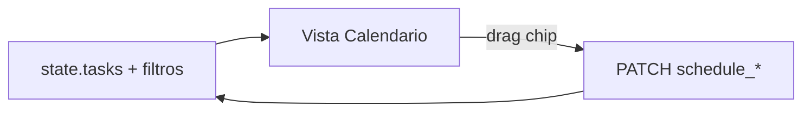
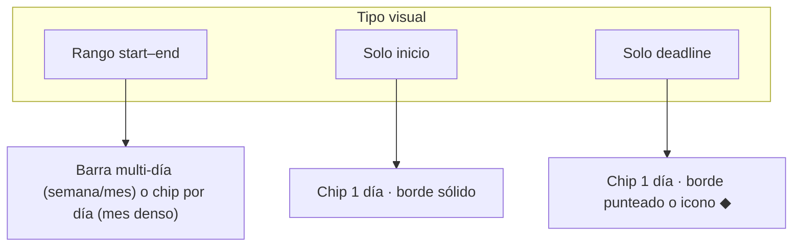

# Spec: vista Calendario (modo Kuiper)

**Alcance:** vista mensual/semanal/diaria de issues planificadas.

**Código previsto:** `kuiper-calendar.js`, integración en `kuiper-ui.js` / `app.js`, estilos en `styles.css`.

**Prerrequisito:** [`kuiper-issue-schedule.md`](kuiper-issue-schedule.md).

**Diseño visual:** [`design-system.md`](../design-system.md) §10 (rail, filtros, tokens).

---

## 1. Objetivo

Ver **cuándo** está planificado el trabajo: deadlines, inicios y rangos multi-día, con **los mismos filtros y agrupación que el tablero Kanban** y apertura rápida del editor.

**Referencia de paridad:** [`kuiper-board-ui.md`](kuiper-board-ui.md) KB-1 (filtros, `groupBy`, `sortBy`).

---

## 2. Activación

Selector de vista en rail Kuiper (junto a agrupación/orden):

```
[ Tablero ] [ Calendario ] [ Gantt ]
```

| Propiedad | Valor |
| --- | --- |
| Pref `boardView` | `'board'` \| `'calendar'` \| `'gantt'` |
| Persistencia | `localStorage` → `board.kuiper.prefs.boardView` |
| URL | `?view=calendar` (opcional; al cargar sobrescribe pref una vez) |
| Default | `'board'` |

Al cambiar vista: **no** recargar API; reutilizar `state.tasks` en memoria.



---

## 3. Layout

```
┌─────────────────────────────────────────────────────────────┐
│ Rail: vista · Mes/Semana/Día · ← Hoy → · filtros           │
├─────────────────────────────────────────────────────────────┤
│ Cabecera días de la semana (en vista mes/semana)            │
├─────────────────────────────────────────────────────────────┤
│ Cuadrícula de celdas (scroll vertical en mes)               │
│  · chips de issue por día                                   │
│  · barras multi-día en vista semana/mes                     │
└─────────────────────────────────────────────────────────────┘
```

---

## 4. Modos de vista

| Modo | Pref `calendarMode` | Descripción |
| --- | --- | --- |
| **Mes** | `'month'` | Cuadrícula 7×5/6; día actual resaltado |
| **Semana** | `'week'` | 7 columnas; más altura por issue |
| **Día** | `'day'` | Una columna; lista temporal opcional |

Default: `'month'`.

### 4.1 Navegación temporal

| Control | Efecto |
| --- | --- |
| `←` / `→` | Periodo anterior/siguiente |
| **Hoy** | Ancla en día actual (Santiago) |
| Título clickable | En mes: picker mes/año (dropdown); en semana: ir a mes |

Pref: `calendarAnchorDate` (`YYYY-MM-DD`).

---

## 5. Filtros y agrupación (paridad con Kanban)

Las vistas Calendario y Gantt **comparten el mismo estado** de filtros y agrupación que el tablero (`state.projectFilters`, `state.epicFilters`, prioridad, flag, `groupBy`, `sortBy`). Los controles del rail (`.kuiper-filters-wrap`, dropdowns agrupación/orden) permanecen visibles y operativos al cambiar de vista.

### 5.1 Filtros

| Filtro | Comportamiento (igual que KB-1) |
| --- | --- |
| Proyecto | Multi-select; oculta issues fuera de selección |
| Épica | Multi-select |
| Prioridad | Multi-select |
| Flag | Toggle / filtro activo |
| Archivadas | Ocultas por defecto; toggle opcional en menú vista |

Al aplicar un filtro en Calendario, el mismo filtro persiste al volver al tablero o al Gantt (`board.kuiper.prefs` + `state` en memoria).

### 5.2 Agrupación (`groupBy`)

Reutilizar los mismos modos que el tablero:

| `groupBy` | Efecto en Calendario |
| --- | --- |
| `none` | Lista plana de chips/barras por día o semana |
| `project` | Secciones por proyecto (cabecera sticky + color proyecto) |
| `epic` | Secciones por épica |
| `priority` | Secciones por nivel de prioridad |

En vista **mes**, cada celda agrupa chips por sección (cabecera compacta dentro de la celda si hay varios grupos). En vista **semana**, filas «all-day» por grupo (análogo a swimlanes horizontales). En vista **día**, listas apiladas por grupo.

La clave `__none__` para proyecto/épica sin asignar se comporta igual que en swimlanes del tablero.

### 5.3 Ordenación (`sortBy`)

Mismas opciones que tablero (`position`, `priority`, `updatedAt`) más **`schedule`** (primera fecha disponible: `start ?? end`, null al final). El orden se aplica **dentro** de cada grupo.

---

## 6. Qué issues se muestran

### 6.1 Criterio de inclusión

Issue visible en día `D` si:

```
(schedule_start_date && schedule_end_date && start <= D <= end)
|| (schedule_start_date && !schedule_end_date && D === start)
|| (!schedule_start_date && schedule_end_date && D === end)
```

### 6.2 Issues sin fechas

No aparecen en cuadrícula. Enlace discreto en rail: **«Sin planificar (N)»** → panel lateral o modal lista (click abre editor). El contador respeta los filtros activos.

---

## 7. Representación visual

### 7.1 Tipos de evento



| Tipo | Vista mes | Vista semana | Vista día |
| --- | --- | --- | --- |
| Rango | Barra continua en fila de la semana (estilo «all-day») | Barra por fila de issue | Bloque horario «todo el día» |
| Solo inicio | Chip compacto | Chip | Chip |
| Solo deadline | Chip + indicador deadline | Igual | Igual |

**Color:** proyecto (`ENTITY_COLORS`). **Texto:** `VIBE-5` mono + título truncado.

### 7.2 Densidad y overflow

| Regla | Detalle |
| --- | --- |
| Máx chips visibles por celda (mes) | 3 + enlace `+N más` |
| `+N más` | Popover con lista del día |
| `compact` density | 2 + `+N` |

### 7.3 Día actual

Celda con borde `--accent-dim`; número del día en `--accent`.

### 7.4 Fin de semana

Fondo `--surface-2` muy sutil (opcional, respeta tema).

---

## 8. Interacción

### 8.1 Click

| Target | Acción |
| --- | --- |
| Chip / barra | Abrir editor issue |
| Celda vacía | Menú contextual: **«Crear issue»** con `schedule_start_date = schedule_end_date = día` y etapa/proyecto de filtros activos |
| `+N más` | Popover; click issue → editor |

### 8.2 Drag and drop

| Origen | Destino | Resultado |
| --- | --- | --- |
| Chip 1 día | Otra celda | Mueve ese día (si solo start → cambia start; solo end → end; si rango → mueve todo el rango) |
| Barra rango | Otra celda | Mueve rango completo manteniendo duración |

Snap a día. PATCH optimista al soltar.

### 8.3 Crear desde calendario

Equivalente a `+` columna pero con fechas pre-rellenadas:

```
POST /cards { …, schedule_start_date, schedule_end_date }
```

Abre editor tras crear (igual que tablero).

---

## 9. Formato e i18n

| Elemento | Regla |
| --- | --- |
| Nombres de día | `Intl` + locale UI |
| Primer día de semana | **Lunes** (coherente con informe semanal) |
| Mes/año en título | `septiembre 2026` / `September 2026` |
| Fechas en chips | Mono solo para ID; fechas en fuente UI |

Claves i18n nuevas: `calendarToday`, `calendarMonth`, `calendarWeek`, `calendarDay`, `calendarUnscheduled`, `calendarMore`, `calendarCreateOnDay`.

---

## 10. Relación con otras vistas

| Acción en Calendario | Reflejo |
| --- | --- |
| Cambiar fechas | Gantt y editor actualizados tras PATCH |
| Filtros | Compartidos en `state`; persisten al cambiar vista |
| `?card=` deep link | Abre editor encima del calendario |

---

## 11. Responsive (≤640px)

| Cambio | Detalle |
| --- | --- |
| Default móvil | Vista **semana** (mes demasiado denso) |
| Swipe horizontal | Cambiar semana |
| Sidebar filtros | Drawer igual que tablero |

Touch: `(hover: none)` — sin hover-only tooltips; tap largo = tooltip.

---

## 12. Lógica pura (`core.js`)

| Función | Uso |
| --- | --- |
| `calendarMonthGrid(anchorDate)` | Matriz de celdas con `YYYY-MM-DD` |
| `calendarWeekDays(anchorDate)` | 7 días desde lunes |
| `issuesForDay(tasks, day)` | Lista ordenada (prioridad desc, luego start) |
| `moveScheduleByDays(issue, delta)` | Nuevo par start/end tras drag |
| `spanWeekRows(issue, weekStart)` | Para barras multi-día en fila semanal |

**Tests:** mes con 28/29/30/31 días, issue que cruza meses, solo deadline, drag +7 días.

---

## 13. Accesibilidad

- Cuadrícula: `role="grid"`, celdas `role="gridcell"`.
- `aria-label` en celda: fecha completa + conteo de issues.
- Navegación teclado: flechas entre celdas; `Enter` abre primer issue o crea.

---

## 14. Errores y vacíos

| Estado | UI |
| --- | --- |
| Mes sin issues | Mensaje suave «Ninguna issue planificada en este periodo» |
| PATCH fallido | Toast + revertir chip |

---

## 15. Fuera de alcance v1

- Vista agenda con **horas** (time entries superpuestos).
- Sincronización calendario externo (Google/Outlook).
- RRULE / eventos recurrentes.
- Recordatorios.
- Resize de barras por asas (v1.1).

---

## 16. Tabla requisito → test

| Requisito | Test |
| --- | --- |
| Solo deadline visible | `issuesForDay` con solo `end` |
| Issue rango cruza semana | `spanWeekRows` |
| Drag mueve rango | `moveScheduleByDays(issue, +3)` |
| Filtros compartidos | Integración: filtrar proyecto oculta chip |
| Agrupación por proyecto | Render mes con `groupBy: project` muestra secciones |
| Paridad filtros con tablero | Cambiar filtro en calendario persiste al volver a board |
