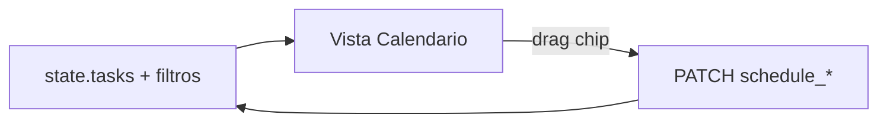
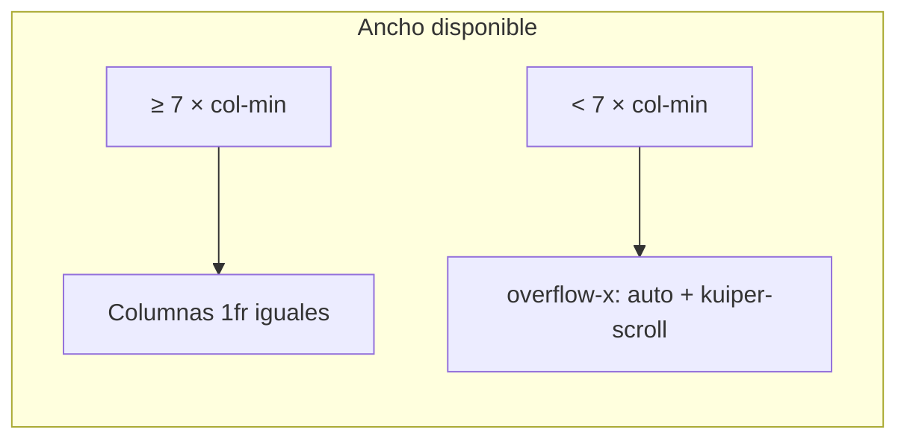
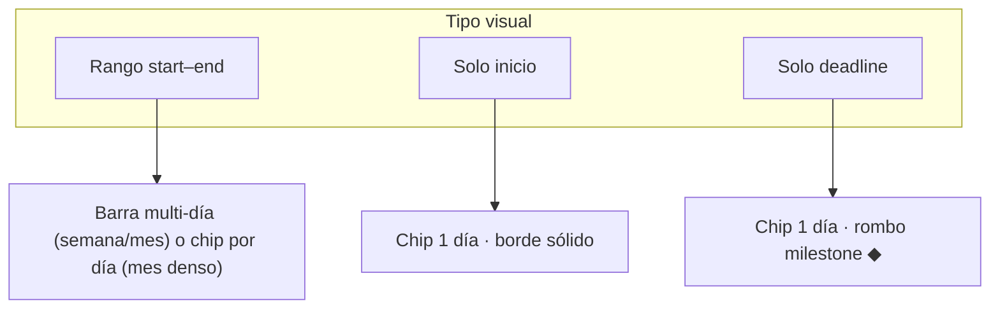

# Spec: vista Calendario (modo Kuiper)

**Alcance:** vista mensual/semanal/diaria de issues planificadas.

**Código previsto:** `kuiper-calendar.js`, integración en `kuiper-ui.js` / `app.js`, estilos en `styles.css`.

**Prerrequisito:** [`kuiper-issue-schedule.md`](kuiper-issue-schedule.md).

**Diseño visual:** [`design-system.md`](../design-system.md) §10 (rail, filtros, tokens).

---

## 1. Objetivo

Ver **cuándo** está planificado el trabajo: deadlines, inicios y rangos multi-día, con **los mismos filtros y agrupación que el tablero Kanban** y apertura rápida del editor.

**Referencia de paridad:** [`kuiper-board-ui.md`](kuiper-board-ui.md) KB-1 (filtros, `groupBy`, `sortBy`).

---

## 2. Activación

Selector de vista en rail Kuiper (junto a agrupación/orden):

```
[ Tablero ] [ Calendario ] [ Gantt ]
```

| Propiedad | Valor |
| --- | --- |
| Pref `boardView` | `'board'` \| `'calendar'` \| `'gantt'` |
| Persistencia | `localStorage` → `board.kuiper.prefs.boardView` |
| URL | `?view=calendar` (opcional; al cargar sobrescribe pref una vez) |
| Default | `'board'` |

Al cambiar vista: **no** recargar API; reutilizar `state.tasks` en memoria.



---

## 3. Layout

```
┌─────────────────────────────────────────────────────────────┐
│ Rail: vista · Mes/Semana/Día · ← Hoy → · filtros           │
├─────────────────────────────────────────────────────────────┤
│ Cabecera días de la semana (en vista mes/semana)            │
├─────────────────────────────────────────────────────────────┤
│ Cuadrícula de celdas (scroll según §3.2)                    │
│  · chips de issue por día                                   │
│  · barras multi-día solo en vista mes (§7.1)                │
└─────────────────────────────────────────────────────────────┘
```

### 3.1 Columnas de igual ancho

En vistas **mes** y **semana**, las 7 columnas (lun–dom) comparten **el mismo ancho**:

| Regla | Detalle |
| --- | --- |
| Grid | `grid-template-columns: repeat(7, minmax(0, 1fr))` (o equivalente) |
| Celdas | Mismo ancho en cabecera y cuerpo; sin columna fija de etiquetas de issue |
| Contenido | Chips con `text-overflow: ellipsis`; no forzar ancho mínimo por título |

### 3.2 Adaptación al ancho y scroll

| Regla | Detalle |
| --- | --- |
| Contenedor | `.kuiper-cal-body` ocupa el ancho disponible del shell |
| Expansión | La cuadrícula **crece** con el viewport hasta el mínimo por columna |
| Mínimo por columna | `--cal-col-min: 96px` (ajustable en `styles.css`; densidad `compact` puede bajar a 80px) |
| Ancho mínimo total | `7 × --cal-col-min` + gaps + padding → debajo de eso aparece **scroll horizontal** |
| Scroll vertical | Vista mes: scroll vertical en cuerpo cuando las filas superan la altura |
| Estilo scroll | Clase `.kuiper-scroll` en el contenedor que hace scroll (ver [`design-system.md`](../design-system.md) §12) |
| Prohibido | Scrollbars ad hoc distintas a `.kuiper-scroll` / column body del design system |



---

## 4. Modos de vista

| Modo | Pref `calendarMode` | Descripción |
| --- | --- | --- |
| **Mes** | `'month'` | Cuadrícula 7×5/6; día actual resaltado; barras multi-día por fila semanal |
| **Semana** | `'week'` | **7 columnas de día** con chips apilados (paridad visual con vista día, §4.2) |
| **Día** | `'day'` | Una columna; listas por grupo |

Default: `'month'`.

### 4.1 Navegación temporal (por modo)

Controles comunes en `.kuiper-cal-nav`:

| Control | Todos los modos |
| --- | --- |
| `←` / `→` | Periodo anterior / siguiente (mes, semana o día según modo) |
| **Hoy** | Ancla en día actual (`BoardCore.ymd()`, Santiago) |

Selector de periodo (sustituye el título estático actual):

| Modo | Selector | Comportamiento |
| --- | --- | --- |
| **Mes** | Mes + año | Botón título abre popover/dropdown: select mes, select año; **Aplicar** actualiza `calendarAnchorDate` al día 1 del mes elegido (o mantiene día si sigue en el mismo mes) |
| **Semana** | Semana ISO | Botón título muestra rango `lun 15 – dom 21 sep 2026`; abre picker: input semana (ISO week + año) o mini-calendario con semana resaltada |
| **Día** | Fecha exacta | Botón título muestra fecha larga; abre `<input type="date">` nativo o picker reutilizando `KuiperDateTimePicker` en modo solo fecha |

| Tecla | Efecto |
| --- | --- |
| Flechas en cuadrícula | Navegar entre celdas (mes/semana) |
| `Enter` en celda | Abrir primer issue o crear |

Pref: `calendarAnchorDate` (`YYYY-MM-DD`). En modo semana, la ancla es **cualquier día** de la semana visible; al navegar se normaliza al lunes de esa semana.

Claves i18n nuevas: `calendarPickMonth`, `calendarPickWeek`, `calendarPickDay`, `calendarWeekRange`, `calendarApply`.

### 4.2 Vista semana ≠ Gantt

**Corrección respecto a implementación v1:** la vista semana **no** es una fila por issue con barras horizontales (`kuiper-cal-bar-row`). Ese patrón pertenece a la vista **Gantt** (`kuiper-gantt-view.md`).

Vista semana correcta:

```
┌──────┬──────┬──────┬──────┬──────┬──────┬──────┐
│ lun  │ mar  │ mié  │ jue  │ vie  │ sáb  │ dom  │
├──────┼──────┼──────┼──────┼──────┼──────┼──────┤
│ chip │ chip │      │ chip │      │      │      │
│ chip │      │ chip │      │      │      │      │
└──────┴──────┴──────┴──────┴──────┴──────┴──────┘
```

| Regla | Detalle |
| --- | --- |
| Estructura | Misma que vista día: **columna por día**, chips apilados verticalmente |
| Issue multi-día | Chip **repetido** en cada día del rango (no barra continua) |
| Agrupación | Cabecera de grupo compacta dentro de cada celda (como mes) |
| Densidad | Sin límite estricto de chips (scroll vertical por columna si hace falta) |
| Drag | Chip desde un día a otro (misma semántica que mes/día) |

**Prohibido en vista semana:** `kuiper-cal-bar`, `kuiper-cal-bar-track`, `spanWeekRows` para render (reservado a Gantt y barras de mes).

---

## 5. Filtros y agrupación (paridad con Kanban)

Las vistas Calendario y Gantt **comparten el mismo estado** de filtros y agrupación que el tablero (`state.projectFilters`, `state.epicFilters`, prioridad, flag, `groupBy`, `sortBy`). Los controles del rail (`.kuiper-filters-wrap`, dropdowns agrupación/orden) permanecen visibles y operativos al cambiar de vista.

### 5.1 Filtros

| Filtro | Comportamiento (igual que KB-1) |
| --- | --- |
| Proyecto | Multi-select; oculta issues fuera de selección |
| Épica | Multi-select |
| Prioridad | Multi-select |
| Flag | Toggle / filtro activo |
| Archivadas | Ocultas por defecto; toggle opcional en menú vista |

Al aplicar un filtro en Calendario, el mismo filtro persiste al volver al tablero o al Gantt (`board.kuiper.prefs` + `state` en memoria).

### 5.2 Agrupación (`groupBy`)

Reutilizar los mismos modos que el tablero:

| `groupBy` | Efecto en Calendario |
| --- | --- |
| `none` | Lista plana de chips/barras por día o semana |
| `project` | Secciones por proyecto (cabecera sticky + color proyecto) |
| `epic` | Secciones por épica |
| `priority` | Secciones por nivel de prioridad |

En vista **mes** y **semana**, cada celda agrupa chips por sección (cabecera compacta dentro de la celda si hay varios grupos). En vista **día**, listas apiladas por grupo en una sola columna.

La clave `__none__` para proyecto/épica sin asignar se comporta igual que en swimlanes del tablero.

### 5.3 Ordenación (`sortBy`)

Mismas opciones que tablero (`position`, `priority`, `updatedAt`) más **`schedule`** (primera fecha disponible: `start ?? end`, null al final). El orden se aplica **dentro** de cada grupo.

---

## 6. Qué issues se muestran

### 6.1 Criterio de inclusión

Issue visible en día `D` si:

```
(schedule_start_date && schedule_end_date && start <= D <= end)
|| (schedule_start_date && !schedule_end_date && D === start)
|| (!schedule_start_date && schedule_end_date && D === end)
```

### 6.2 Issues sin fechas

No aparecen en calendario ni en contadores del rail. Para planificarlas, usar el tablero o el editor.

---

## 7. Representación visual

### 7.1 Tipos de evento



| Tipo | Vista mes | Vista semana | Vista día |
| --- | --- | --- | --- |
| Rango | Barra continua en fila de la semana (estilo «all-day») | Chip en **cada día** del rango | Chip |
| Solo inicio | Chip compacto | Chip | Chip |
| Solo deadline | Chip con estilo milestone (§7.1.1) | Igual | Igual |

**Color:** proyecto (`ENTITY_COLORS`). **Texto:** `VIBE-5` mono + título truncado.

#### 7.1.1 Milestone (solo deadline)

Issues con **solo** `schedule_end_date` (sin `schedule_start_date`) se muestran **como chip de un día** (mismo borde sólido que el resto) y llevan un **rombo** (`.kuiper-cal-chip-milestone`, coherente con Gantt). No usar borde punteado.

### 7.2 Densidad y overflow

| Regla | Detalle |
| --- | --- |
| Máx chips visibles por celda (mes) | 3 + enlace `+N más` |
| `+N más` | Popover con lista del día |
| `compact` density | 2 + `+N` |

### 7.3 Día actual

Celda con borde `--accent-dim`; número del día en `--accent`.

### 7.4 Fin de semana

Sábado y domingo (columnas 6 y 7, semana empezando en lunes) **deben** verse distintos del lunes–viernes:

| Elemento | Clase | Estilo |
| --- | --- | --- |
| Celda mes / semana | `.kuiper-cal-cell.is-weekend`, `.kuiper-cal-week-col.is-weekend` | Fondo `color-mix(in srgb, var(--surface-2) 55%, var(--surface-1))` |
| Cabecera día | `.kuiper-cal-head .is-weekend` | Texto `--muted` (sin cambiar peso) |
| Hoy en fin de semana | `.is-today.is-weekend` | Prioridad al resaltado de hoy (`--accent-dim`); el tinte fin de semana se mezcla por debajo |

Detección: `new Date(day + 'T12:00:00Z').getUTCDay()` ∈ `{0, 6}` (domingo, sábado).

Coherencia con Gantt: mismo criterio de fin de semana que `--gantt-day-weekend` en espíritu, adaptado a tokens del calendario.

---

## 8. Interacción

### 8.1 Click

| Target | Acción |
| --- | --- |
| Chip / barra | Abrir editor issue |
| Celda vacía | Menú contextual: **«Crear issue»** con `schedule_start_date = schedule_end_date = día` y etapa/proyecto de filtros activos |
| `+N más` | Popover; click issue → editor |

### 8.2 Drag and drop

| Origen | Destino | Resultado |
| --- | --- | --- |
| Chip 1 día | Otra celda | Mueve ese día (si solo start → cambia start; solo end → end; si rango → mueve todo el rango) |
| Barra rango | Otra celda | Mueve rango completo manteniendo duración |

Snap a día. PATCH optimista al soltar.

### 8.3 Crear desde calendario

Equivalente a `+` columna pero con fechas pre-rellenadas:

```
POST /cards { …, schedule_start_date, schedule_end_date }
```

Abre editor tras crear (igual que tablero).

---

## 9. Formato e i18n

| Elemento | Regla |
| --- | --- |
| Nombres de día | `Intl` + locale UI |
| Primer día de semana | **Lunes** (coherente con informe semanal) |
| Mes/año en título | `septiembre 2026` / `September 2026` |
| Fechas en chips | Mono solo para ID; fechas en fuente UI |

Claves i18n: `calendarToday`, `calendarMonth`, `calendarWeek`, `calendarDay`, `calendarUnscheduled`, `calendarMore`, `calendarCreateOnDay`, `calendarPickMonth`, `calendarPickWeek`, `calendarPickDay`, `calendarWeekRange`, `calendarApply`.

---

## 10. Relación con otras vistas

| Acción en Calendario | Reflejo |
| --- | --- |
| Cambiar fechas | Gantt y editor actualizados tras PATCH |
| Filtros | Compartidos en `state`; persisten al cambiar vista |
| `?card=` deep link | Abre editor encima del calendario |

---

## 11. Responsive (≤640px)

| Cambio | Detalle |
| --- | --- |
| Default móvil | Vista **semana** (mes demasiado denso) |
| Swipe horizontal | Cambiar semana |
| Sidebar filtros | Drawer igual que tablero |

Touch: `(hover: none)` — sin hover-only tooltips; tap largo = tooltip.

---

## 12. Lógica pura (`core.js`)

| Función | Uso |
| --- | --- |
| `calendarMonthGrid(anchorDate)` | Matriz de celdas con `YYYY-MM-DD` |
| `calendarWeekDays(anchorDate)` | 7 días desde lunes |
| `issuesForDay(tasks, day)` | Lista ordenada (prioridad desc, luego start) |
| `moveScheduleByDays(issue, delta)` | Nuevo par start/end tras drag |
| `spanWeekRows(issue, weekStart)` | Solo vista **mes** (barras) y **Gantt**; no vista semana calendario |
| `isWeekendYmd(day)` | `true` si sábado o domingo |

**Tests:** mes con 28/29/30/31 días, issue que cruza meses, solo deadline, drag +7 días.

---

## 13. Accesibilidad

- Cuadrícula: `role="grid"`, celdas `role="gridcell"`.
- `aria-label` en celda: fecha completa + conteo de issues.
- Navegación teclado: flechas entre celdas; `Enter` abre primer issue o crea.

---

## 14. Errores y vacíos

| Estado | UI |
| --- | --- |
| Mes sin issues | Mensaje suave «Ninguna issue planificada en este periodo» |
| PATCH fallido | Toast + revertir chip |

---

## 15. Fuera de alcance v1

- Vista agenda con **horas** (time entries superpuestos).
- Sincronización calendario externo (Google/Outlook).
- RRULE / eventos recurrentes.
- Recordatorios.
- Resize de barras por asas (v1.1).

---

## 16. Tabla requisito → test

| Requisito | Test |
| --- | --- |
| Solo deadline visible | `issuesForDay` con solo `end` |
| Chip milestone lleva rombo | Fixture render: `!start && end` → `.is-milestone` + rombo |
| Issue rango cruza semana (mes) | `spanWeekRows` |
| Vista semana: chip por día, no barra | `issuesForDay` × 7 días; sin `kuiper-cal-bar` en week HTML |
| Fin de semana | `isWeekendYmd('2026-09-19')` true (sáb); lun–vie false |
| Columnas igual ancho | CSS/DOM: 7 columnas `1fr` en head y row |
| Scroll bajo mínimo | Contenedor con `min-width: calc(7 * var(--cal-col-min))` |
| Navegación mes ±1 | `shiftAnchor(-1)` en modo month cambia mes |
| Picker mes/año | Cambiar a marzo 2027 actualiza `calendarAnchorDate` |
| Picker semana | Ancla en cualquier día de semana ISO 38 → lunes 14 sep |
| Picker día | Input fecha → `calendarAnchorDate` exacto |
| Drag mueve rango | `moveScheduleByDays(issue, +3)` |
| Filtros compartidos | Integración: filtrar proyecto oculta chip |
| Agrupación por proyecto | Render mes con `groupBy: project` muestra secciones |
| Paridad filtros con tablero | Cambiar filtro en calendario persiste al volver a board |

---

## 17. Deuda conocida (v1 actual → esta spec)

| Gap | Estado actual | Objetivo |
| --- | --- | --- |
| Vista semana tipo Gantt | `renderWeek` usa `kuiper-cal-bar-row` | Reescribir como 7 columnas con chips (§4.2) |
| Fin de semana | Sin clase `is-weekend` | §7.4 |
| Columnas fluidas + scroll | `repeat(7, 1fr)` sin mínimo | §3.1–3.2 |
| Selectores mes/semana/día | Solo título texto + ← → | §4.1 pickers |
| Borde punteado | Implementado; sin doc visible | §7.1.1 (documentado) |
