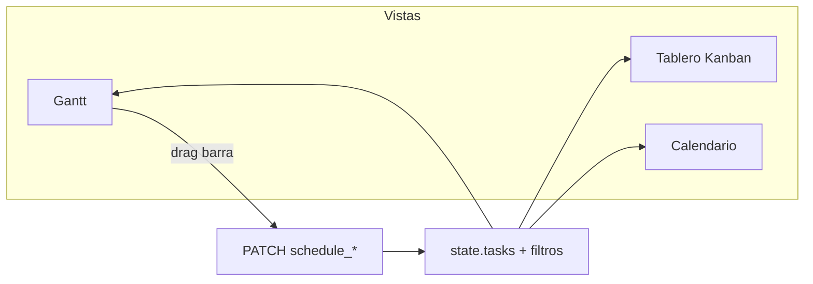
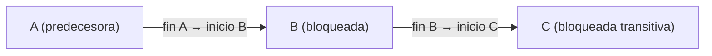

# Spec: vista Gantt (modo Kuiper)

**Alcance:** nueva vista de tablero alternativa al Kanban.

**Código previsto:** `kuiper-gantt.js`, `vendor/gantt-renderer/`, estilos en `styles.css` + `vendor/gantt-renderer/styles/gantt.css`, integración en `kuiper-ui.js` / `app.js`.

---

## v2 — Replanteamiento (referencia Jira Timeline)

**Motor:** [gantt-renderer](https://github.com/doberkofler/gantt-renderer) (MIT, vanilla ESM). Dependencias `blocks` con **curvas Bézier** en capa SVG propia (`kuiper-bezier-layer`); el conector ortogonal del motor se oculta.

| Requisito | Comportamiento |
| --- | --- |
| Jerarquía | Proyecto → épica (colapsable) → issue |
| Barra épica/proyecto | `start` = min(`schedule_start`) hijos; `end` = max(`schedule_end`) hijos (`BoardCore.scheduleBoundsForTasks`) |
| Agrupación Gantt | Siempre por **proyecto**; épicas como filas `kind: project` hijas |
| Orden | Por fecha de planificación dentro de cada grupo (`scheduleSortKey`) |
| Panel izquierdo | Columnas: Key, Issue, Start, End (sticky con el timeline) |
| Sin fechas | En lista con «—»; barra oculta; clic en fila + clic en timeline → `start` y `end` ese día |
| Pan/zoom | Scroll horizontal nativo; zoom Día/Semana/Mes (`scale`); botón Hoy |
| Minimapa | Franja inferior clicable; rectángulo = viewport |
| Drag/resize | `onTaskMove` / `onTaskResize` → PATCH + propagación `cascadeScheduleMove` |

---

**Prerrequisito:** [`kuiper-issue-schedule.md`](kuiper-issue-schedule.md).

**Diseño visual:** [`design-system.md`](../design-system.md) §10 (rail, filtros, tokens).

---

## 1. Objetivo

Visualizar issues con **ventana temporal** en un diagrama de barras horizontal, con zoom, **filtros y agrupación idénticos al tablero Kanban**, dependencias entre issues y edición por drag de barras con **propagación recursiva** a tareas bloqueadas.

**Referencia de paridad:** [`kuiper-board-ui.md`](kuiper-board-ui.md) KB-1 (filtros, `groupBy`, `sortBy`).

---

## 2. Activación y navegación

Selector de vista en rail Kuiper (junto a agrupación/orden):

```
[ Tablero ] [ Calendario ] [ Gantt ]
```

| Propiedad | Valor |
| --- | --- |
| Pref `boardView` | `'board'` \| `'calendar'` \| `'gantt'` |
| Persistencia | `localStorage` → `board.kuiper.prefs.boardView` |
| URL | `?view=gantt` (opcional; al cargar sobrescribe pref una vez) |
| Default | `'board'` |

Al cambiar vista: **no** recargar API; reutilizar `state.tasks` en memoria.



---

## 3. Layout

```
┌─────────────────────────────────────────────────────────────┐
│ Rail (vista, filtros, zoom, rango temporal, hoy)            │
├──────────────┬──────────────────────────────────────────────┤
│ Sidebar      │  Cabecera timeline (días/semanas/meses)     │
│ izquierda    ├──────────────────────────────────────────────┤
│ (filas)      │  Área scroll: barras + grid + dependencias  │
│              │                                               │
├──────────────┴──────────────────────────────────────────────┤
│ Panel inferior colapsable: «Sin fechas» (N)                 │
└─────────────────────────────────────────────────────────────┘
```

| Zona | Contenido |
| --- | --- |
| Sidebar filas | Label de grupo (proyecto/épica/prioridad) + filas de issues |
| Timeline header | Marcas según zoom; línea vertical «hoy» |
| Canvas | Barras, grid, flechas de dependencia |
| Panel inferior | Issues sin `schedule_start_date` ni `schedule_end_date` |

### 3.1 Dimensiones (design system)

| Token | Valor |
| --- | --- |
| Altura fila | 32px (`comfortable`), 28px (`compact`) |
| Altura barra | 20px, radius 4px |
| Ancho columna día (zoom día) | 28px |
| Ancho columna semana | 80px |
| Sidebar ancho | `min(280px, 34vw)` |
| Color barra | Color del **proyecto** (`ENTITY_COLORS`), opacity 0.85 |
| Barra solo-deadline | Rombo 10px en `end` |
| Barra solo-start | 1 día de ancho mínimo |
| Texto fila | ID mono + título truncado |
| Grid fin de semana | `--surface-2` sutil |
| Línea hoy | `--accent` 2px |

---

## 4. Filtros, agrupación y datos mostrados

### 4.1 Filtros (paridad con Kanban)

Las vistas Gantt y Calendario **comparten el mismo estado** de filtros que el tablero (`state.projectFilters`, `state.epicFilters`, prioridad, flag, `groupBy`, `sortBy`). Los controles del rail (`.kuiper-filters-wrap`, dropdowns agrupación/orden) permanecen visibles y operativos al cambiar de vista.

| Filtro | Comportamiento (igual que KB-1) |
| --- | --- |
| Proyecto | Multi-select; oculta filas fuera de selección |
| Épica | Multi-select |
| Prioridad | Multi-select |
| Flag | Toggle / filtro activo |
| Archivadas | Ocultas por defecto; toggle «Mostrar archivadas» en menú vista (off por defecto) |

Al aplicar un filtro en Gantt, persiste al volver al tablero o al Calendario.

**Dependencias y filtros:** las flechas `blocks` / `blocked_by` se dibujan solo entre issues **visibles** tras filtrar. Si un predecesor está oculto por filtro, la flecha al sucesor visible se muestra como «incompleta» (anclada al borde del viewport).

### 4.2 Agrupación (`groupBy`)

Reutilizar los mismos modos que el tablero:

| `groupBy` | Filas en Gantt |
| --- | --- |
| `none` | Una fila por issue |
| `project` | Cabecera proyecto (sticky) + filas hijas |
| `epic` | Cabecera épica + filas hijas |
| `priority` | Cabecera prioridad + filas hijas |

Cabeceras de grupo: sticky en scroll vertical, fondo `--surface-1`, marca de color (dot/tri) coherente con swimlanes del tablero. La clave `__none__` para proyecto/épica sin asignar se comporta igual que en swimlanes.

### 4.3 Ordenación (`sortBy`)

Mismas opciones que tablero (`position`, `priority`, `updatedAt`) más **`schedule`** (primera fecha disponible: `start ?? end`, null al final). El orden se aplica **dentro** de cada grupo.

### 4.4 Clasificación en el Gantt

| Categoría | Criterio | Render |
| --- | --- | --- |
| Programada | `start` o `end` presente | Fila en canvas |
| Sin fechas | ambos `null` | Panel inferior |

### 4.5 Rango visible (viewport)

| Regla | Detalle |
| --- | --- |
| Cálculo inicial | `min(start)` y `max(end)` de issues visibles ± padding 7 días |
| Sin issues programadas | Semana actual ± 2 semanas |
| Navegación | Botones ← →, botón «Hoy», scroll horizontal |
| Persistencia rango | `ganttAnchorDate` en prefs (día central o inicio visible) |

---

## 5. Representación de barras

### 5.1 Geometría

Para issue con rango `[start, end]` inclusivo:

```
left  = columnIndex(start)
width = columnIndex(end) - columnIndex(start) + 1 columna
```

| Caso | Barra |
| --- | --- |
| Solo `start` | Ancho 1 columna en `start` |
| Solo `end` | Rombo milestone en columna `end` |
| Ambos | Barra continua |

### 5.2 Contenido barra

| Zoom | Contenido |
| --- | --- |
| Día / Semana | ID + título si cabe |
| Mes | Solo ID o punto de color |

Tooltip (`tooltip.js`): título, proyecto, rango formateado, estimación vs logged (informativo, no editable).

### 5.3 Indicadores opcionales en barra

| Indicador | Condición |
| --- | --- |
| Borde rojo | `end < hoy` y etapa ≠ Done (configurable por nombre etapa terminal) |
| Icono flag | `flagged` |
| Badge prioridad | `priority > 0` en sidebar, no en barra |

---

## 6. Dependencias (links)

Fuente: `card_links` (`blocks`, `blocked_by`, `relates`) ya cargados en `state.tasks` (`blockedBy`, `blocks`, `related`).

### 6.1 Visualización

| `link_type` | Flecha |
| --- | --- |
| `blocks` (A blocks B) | De **fin** de A → **inicio** de B (dependencia finish-to-start) |
| `blocked_by` | Equivalente visual al inverso de `blocks` |
| `relates` | Línea punteada gris (`--faint`); **no** participa en propagación al mover |

Reglas de dibujo:

- SVG overlay único sobre el canvas; recalcular en scroll, resize y zoom.
- Si falta fecha en un extremo: anclar al borde visible del viewport con estilo «incompleto» (`--faint`, trazo discontinuo).
- Hover en flecha `blocks`: resaltar predecesora, sucesora y cadena transitiva.
- Toggle en menú vista: **«Mostrar dependencias»** (on por defecto).



### 6.2 Grafo de bloqueo

Construir en `core.js` un grafo dirigido **solo con aristas `blocks`**:

- Arista `A → B` si A `blocks` B (A debe terminar antes de que B empiece).
- Normalizar `blocked_by` al mismo grafo (B depende de A).
- Ignorar `relates` para propagación.

Funciones puras:

| Función | Uso |
| --- | --- |
| `buildBlockingGraph(tasks)` | Mapa `id → Set<successorId>` |
| `blockingSuccessors(graph, rootId)` | Sucesoras transitivas (DFS/BFS), sin incluir `rootId` |
| `detectBlockingCycle(graph)` | Detectar ciclos; si hay ciclo, desactivar propagación y mostrar aviso en UI |

### 6.3 Propagación al mover (finish-to-start en cadena)

Al **mover** o **redimensionar** una issue predecesora, las issues **bloqueadas por ella** (directa o transitivamente vía `blocks`) se desplazan **recursivamente** manteniendo su duración.

#### Desplazamiento por drag (mover barra)

1. Usuario arrastra issue `T` con delta de `Δ` días (entero, snap a día).
2. Actualizar schedule de `T`: `start' = start + Δ`, `end' = end + Δ` (o equivalente si solo hay un extremo).
3. Obtener `S = blockingSuccessors(graph, T.id)`.
4. Para cada `id ∈ S` (en cualquier orden topológico válido): aplicar el **mismo** `Δ` a sus fechas de schedule (mantener span si tiene ambos extremos).
5. Un solo batch de PATCH (o PATCH secuenciales con rollback conjunto si falla alguno).

**Preview en drag:** durante el arrastre, las barras de toda la cadena `T ∪ S` se mueven en fantasma antes del PATCH.

#### Redimensionar barra (asas)

| Asa | Efecto en sucesoras |
| --- | --- |
| Izquierda (cambia `start`) | Sin propagación a bloqueadas (solo cambia inicio de la propia tarea). |
| Derecha (cambia `end`) | Si el nuevo `end` empuja más allá del `start` de una sucesora directa, desplazar esa sucesora y **toda su cadena** el mínimo `Δ` necesario para restaurar `end(pred) < start(succ)` (regla finish-to-start). Propagación recursiva igual que en drag. |

#### Casos borde

| Caso | Comportamiento |
| --- | --- |
| Sucesora sin fechas | No se mueve; la flecha sigue «incompleta». Opcional: toast «B no tiene fechas de planificación». |
| Sucesora solo con `end` (milestone) | Mover `end` por el mismo `Δ`. |
| Sucesora solo con `start` | Mover `start` por el mismo `Δ`. |
| Ciclo en `blocks` | No propagar; toast de advertencia; permitir mover solo `T`. |
| Mover sucesora manualmente | Permitido; **no** arrastrar predecesoras en cascada inversa. |
| `relates` | Sin efecto en propagación. |

### 6.4 Teclado con propagación

`←` / `→` y `Shift+←/→` en fila seleccionada aplican el mismo delta a `T` y a `blockingSuccessors(T)`.

---

## 7. Interacción

### 7.1 Click

| Target | Acción |
| --- | --- |
| Barra / fila issue | Abrir editor (`openEditor`) |
| Cabecera timeline | Sin acción |
| ID en sidebar | Copiar URL `?card=` |

### 7.2 Drag de barra (mover)

| Gesto | Efecto |
| --- | --- |
| Drag cuerpo | Desplaza `start` y `end` manteniendo duración (si hay ambos). **Propaga** `Δ` a todas las bloqueadas transitivas (§6.3). |
| Solo `start` | Mueve solo start (duración cambia). Sin propagación a bloqueadas. |
| Solo `end` | Mueve solo end. Puede propagar si viola finish-to-start (§6.3). |
| Solo milestone | Mueve `end`. Propaga `Δ` a bloqueadas transitivas. |

- Snap a **día** (columna).
- Preview fantasma durante drag (barra arrastrada + toda la cadena de sucesoras).
- Al soltar: batch `PATCH` de todas las issues afectadas (optimistic UI + rollback conjunto si error).
- Sin fechas → drag desde panel inferior a canvas: asigna `start = dropDay`, `end = dropDay` (sin propagación hasta que existan links y fechas en sucesoras).

### 7.3 Resize (asas)

Si hay `start` y `end`:

| Asa | Cambia |
| --- | --- |
| Izquierda | `schedule_start_date` |
| Derecha | `schedule_end_date` |

Mínimo 1 día. Si asas se cruzan → intercambiar normalizando. Asa derecha: ver propagación finish-to-start en §6.3.

### 7.4 Zoom

| Nivel | Columna = | Header |
| --- | --- | --- |
| `day` | 1 día | Lun 22, Mar 23… |
| `week` | 1 semana (ISO, lunes) | Sem 38 · 22 sep |
| `month` | 1 mes | Sep 2026 |

Pref: `ganttZoom`. Atajo: `+` / `-` con foco en canvas.

### 7.5 Scroll

| Eje | Comportamiento |
| --- | --- |
| Horizontal | Timeline + barras sincronizados |
| Vertical | Sidebar + canvas sincronizados (scroll-linked) |

Touch: pan horizontal con un dedo; vertical con scroll nativo en contenedor único.

---

## 8. Teclado y accesibilidad

| Tecla | Acción (foco en fila seleccionada) |
| --- | --- |
| `Enter` | Abrir editor |
| `←` / `→` | Mover 1 día la fila seleccionada **y su cadena bloqueada** (con PATCH) |
| `Shift+←/→` | Mover 7 días (misma propagación) |

- `role="grid"` en canvas; filas `role="row"`.
- Barra: `aria-label` con título y rango.
- Contraste según `design-system.md`.

---

## 9. Rendimiento

| Regla | Detalle |
| --- | --- |
| Issues | Hasta ~500 visibles sin virtualización; >500 activar virtual scroll vertical |
| Re-render | Diff por `task.id` + fechas; no destruir DOM completo en cada PATCH |
| Dependencias | SVG overlay único; recalcular en scroll/resize |

---

## 10. Errores y estados vacíos

| Estado | UI |
| --- | --- |
| Sin issues programadas | Mensaje centrado + CTA «Ir al tablero» |
| PATCH fallido | Toast error + revertir barra |
| Cargando board | Skeleton filas |

---

## 11. Lógica pura (`core.js`) — dependencias

Además de geometría de barras (§5), añadir:

| Función | Uso |
| --- | --- |
| `applyScheduleDelta(issue, deltaDays)` | Nuevo par start/end tras `Δ` |
| `cascadeScheduleMove(tasks, graph, rootId, deltaDays)` | `{ patches: [{ id, schedule_start_date, schedule_end_date }] }` para root + sucesoras |
| `minDeltaForFinishToStart(pred, succ)` | `Δ` mínimo al alargar `end` de pred |
| `detectBlockingCycle(graph)` | Ciclo → sin propagación |

**Tests obligatorios:** cadena A→B→C con drag +3 días, bifurcación A→B y A→C, ciclo detectado, sucesora sin fechas ignorada, resize asa derecha empuja cadena.

---

## 12. Fuera de alcance v1

- Asignación de recursos / capacidad.
- Baselines y % completado en barra.
- Export PNG/PDF.
- Critical path automático resaltado.
- Horas intradía.
- Tipos de dependencia distintos de finish-to-start (start-to-start, lag/lead).
- Propagación inversa (mover sucesora no mueve predecesoras).

---

## 13. Tabla requisito → test

| Requisito | Test |
| --- | --- |
| Issue rango en Gantt | `barGeometry({ start, end }, zoom)` |
| Drag mueve rango | `moveScheduleByDays` + integración PATCH |
| Solo deadline visible | milestone en columna `end` |
| Filtros compartidos | Integración: filtrar proyecto oculta barra |
| Agrupación por épica | Render con `groupBy: epic` y cabeceras sticky |
| Dependencias visuales | Render flecha `blocks` con fechas completas |
| Propagación recursiva | `cascadeScheduleMove`: A→B→C, drag A +2 → B y C +2 |
| Ciclo bloqueante | `detectBlockingCycle` → solo mueve root |
| Resize fin empuja cadena | `minDeltaForFinishToStart` + cascade |

---

## 14. Orden de implementación sugerido

1. [`kuiper-issue-schedule.md`](kuiper-issue-schedule.md) — migración, API, core, editor.
2. Selector de vista + prefs (`boardView`); filtros/agrupación compartidos en rail.
3. [`kuiper-calendar-view.md`](kuiper-calendar-view.md) — lectura primero, drag después.
4. Esta spec — lectura, zoom, dependencias visuales, drag/resize con propagación recursiva.
