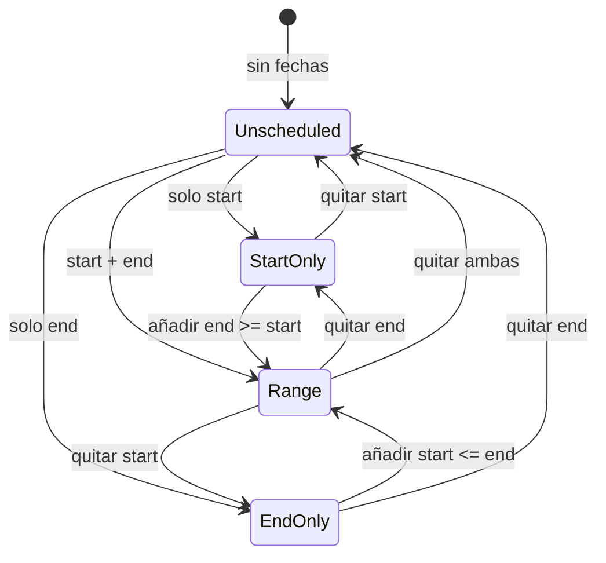

# Spec: fechas de planificación en issues

**Alcance:** modo Kuiper (`?kuiper=1`). Persistencia SQLite + API + editor.

**Código previsto:** migración SQL, `server/db/repositories/cards.js`, `server/board-view.js`, `kuiper-issue-panel.js`, `core.js`.

**Dependencias:** [`kuiper-platform.md`](kuiper-platform.md), [`kuiper-editor.md`](kuiper-editor.md).

**Consumidores:** [`kuiper-calendar-view.md`](kuiper-calendar-view.md), [`kuiper-gantt-view.md`](kuiper-gantt-view.md).

---

## 1. Concepto

Cada issue puede tener **dos fechas de calendario opcionales e independientes**:

| Campo | Significado |
| --- | --- |
| `schedule_start_date` | Día previsto de **inicio** del trabajo (planificación). |
| `schedule_end_date` | Día previsto de **fin** o deadline (planificación). |

Son **planificación visual**, no métricas de ejecución.

### 1.1 Independencia explícita (invariantes)

| Fuente | ¿Afecta schedule? | Notas |
| --- | --- | --- |
| `estimated_minutes` | **No** | Duración estimada ≠ ventana calendario. |
| `time_entries` (`started_at`, `ended_at`, `duration_minutes`) | **No** | Tiempo real ≠ planificación. |
| Timer activo | **No** | |
| `created_at` / `updated_at` | **No** | Metadata distinta. |
| Cambio de etapa (`stage_id`) | **No** en v1 | Automatismos futuros fuera de alcance. |
| Links `blocks` / `blocked_by` | **No** al crear/editar link | No recalcular schedule automáticamente. En Gantt, al **mover** una predecesora, sí se propagan fechas a bloqueadas (ver [`kuiper-gantt-view.md`](kuiper-gantt-view.md) §6). |

**Prohibido** derivar, sincronizar ni sobrescribir schedule desde estimación o time log (salvo acción explícita del usuario en el editor).

---

## 2. Modelo de datos

### 2.1 Migración SQL

```sql
ALTER TABLE cards ADD COLUMN schedule_start_date TEXT; -- YYYY-MM-DD o NULL
ALTER TABLE cards ADD COLUMN schedule_end_date   TEXT; -- YYYY-MM-DD o NULL

CREATE INDEX idx_cards_schedule_start ON cards(board_id, schedule_start_date)
  WHERE schedule_start_date IS NOT NULL;
CREATE INDEX idx_cards_schedule_end ON cards(board_id, schedule_end_date)
  WHERE schedule_end_date IS NOT NULL;
```

### 2.2 Formato y validación

| Regla | Detalle |
| --- | --- |
| Formato | `YYYY-MM-DD` (misma convención que `day` del informe semanal). |
| Timezone de interpretación | `America/Santiago` (`BoardCore.ymd`, `addDays`, `weekdayIndex`). |
| Sin hora | Solo fecha de calendario; no almacenar hora en v1. |
| Nullable | Ambos pueden ser `null`. |
| Orden | Si ambos presentes: `schedule_start_date <= schedule_end_date`. |
| Normalización API | Fechas inválidas → `400`. Si `start > end` tras PATCH → `400` con mensaje claro. |
| Borrado | Enviar `null` en PATCH limpia el campo. |

### 2.3 Semántica por combinación



| `start` | `end` | Semántica UI |
| --- | --- | --- |
| ✗ | ✗ | Sin planificación; no aparece en Calendario/Gantt salvo panel «sin fechas». |
| ✓ | ✗ | Inicio planificado; en calendario = **un día** en `start`. |
| ✗ | ✓ | Deadline; en calendario = **un día** en `end` (estilo milestone). |
| ✓ | ✓ | Ventana inclusiva `[start … end]`; barra/rango en vistas temporales. |

---

## 3. API

### 3.1 Lectura

| Endpoint | Campos nuevos |
| --- | --- |
| `GET /boards/:slug/state` | En cada task: `scheduleStartDate`, `scheduleEndDate` (`null` o string). |
| `GET /cards/:id/detail` | En `card`: `schedule_start_date`, `schedule_end_date`. |

### 3.2 Escritura

`PATCH /cards/:id` acepta:

```json
{
  "schedule_start_date": "2026-09-22",
  "schedule_end_date": "2026-09-26"
}
```

| Comportamiento | Detalle |
| --- | --- |
| Parcial | Se puede actualizar solo uno de los dos. |
| Evento historial | `event_type: 'schedule_changed'` con payload `{ schedule_start_date, schedule_end_date }` (valores tras el cambio). |
| `updated_at` | Se actualiza al cambiar schedule (como `estimated_minutes`). |
| Archivadas | Conservan fechas; no se muestran en vistas por defecto. |

### 3.3 Consulta futura (opcional v1.1)

`GET /boards/:slug/cards?schedule_from=…&schedule_to=…` para cargas parciales. **v1:** el snapshot completo basta si el tablero es pequeño.

---

## 4. Estado UI (`board-view.js`)

Mapeo en `snapshotToState`:

```javascript
scheduleStartDate: card.schedule_start_date ?? null,
scheduleEndDate: card.schedule_end_date ?? null,
```

---

## 5. Editor de issue

### 5.1 Ubicación

Nuevo bloque en aside (`kuiper-issue-panel.js`), **entre Flag y Tags**:

```
… Prioridad · Flag
── Planificación ──
  Inicio    [—]  ← KuiperDateTimePicker (solo fecha)
  Fin       [—]
… Tags · Estimación · Tiempo
```

### 5.2 Interacción

| Acción | Comportamiento |
| --- | --- |
| Click trigger fecha | Abre `KuiperDateTimePicker` en modo `date` (reutilizar picker existente). |
| Placeholder | `—` si vacío. |
| Formato visible | `Intl.DateTimeFormat` según locale UI (`es`/`en`), timezone explícita Santiago. |
| Guardar | Incluido en PATCH al pulsar Guardar/Crear (mismo draft que estimación). |
| Validación cliente | Si ambas rellenas y `start > end`, bloquear guardado + mensaje inline. |
| Atajos | `Tab` entre campos; `Escape` cierra picker sin cerrar editor. |

### 5.3 i18n (claves nuevas)

| Clave | EN | ES |
| --- | --- | --- |
| `scheduleSection` | Schedule | Planificación |
| `scheduleStart` | Start date | Fecha inicio |
| `scheduleEnd` | End date | Fecha fin |
| `scheduleInvalidRange` | End date must be on or after start date | La fecha fin debe ser igual o posterior a la de inicio |
| `histScheduleChanged` | Schedule updated | Planificación actualizada |

### 5.4 Tarjeta colapsada (tablero Kanban)

**v1:** no mostrar fechas en `.kuiper-card` (evitar ruido). Opcional v1.1: chip mono `22–26 sep` si hay rango.

---

## 6. Lógica pura (`core.js`)

Funciones testeables (sin DOM):

| Función | Entrada | Salida |
| --- | --- | --- |
| `validateSchedule(start, end)` | dos `YYYY-MM-DD` o `null` | `{ ok: true }` o `{ ok: false, code: 'invalid_range' \| 'invalid_format' }` |
| `scheduleSpanDays(start, end)` | rango válido | entero ≥ 1 (inclusivo) |
| `issueIntersectsRange(issue, from, to)` | issue + ventana | boolean (para filtrar vistas) |
| `normalizeSchedulePatch({ start, end })` | parcial | objeto validado o error |

**Tests obligatorios:** formato, `start > end`, solo start, solo end, intersección con ventana, DST (aritmética UTC como `addDays`).

---

## 7. Errores

| Código HTTP | Cuándo |
| --- | --- |
| `400` | Formato fecha inválido |
| `400` | `start > end` |
| `404` | Card inexistente |

---

## 8. Edge cases

| Caso | Comportamiento |
| --- | --- |
| Issue nueva sin fechas | `null`; visible solo en backlog «sin planificar». |
| Usuario pone `end` antes que `start` | Rechazo con mensaje. |
| Cambio de locale | Labels y formato visible cambian; datos ISO no cambian. |
| Tarjeta archivada con fechas | Datos persisten; oculta en vistas por defecto. |
| Duplicar issue (si existe) | Copiar fechas en v1.1; v1: no duplicar (sin feature duplicate). |

---

## 9. Fuera de alcance v1

- Horas en schedule (datetime).
- Sincronización automática con time logs o estimación.
- Recordatorios / notificaciones.
- Modo clásico (`localStorage`).

---

## 10. Tabla requisito → test

| Requisito | Test |
| --- | --- |
| Schedule independiente de estimate/time | API: PATCH estimate no toca schedule; POST time-entry no toca schedule |
| `start > end` rechazado | `validateSchedule` + API 400 |
| Solo start / solo end / rango | `issueIntersectsRange` |
| Historial | Evento `schedule_changed` en detail |
