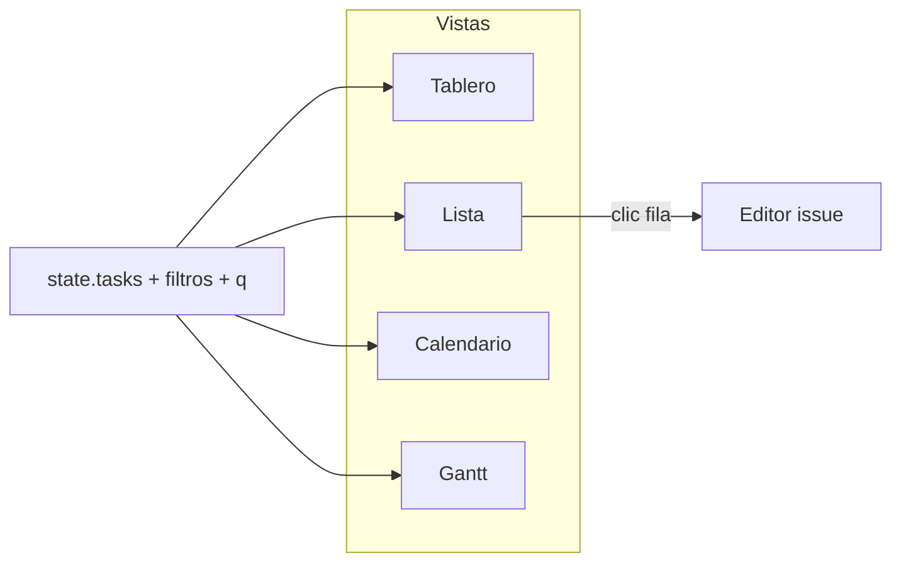

# Spec: vista Lista (modo Kuiper)

**Alcance:** vista tabular de issues del tablero actual, al mismo nivel que Tablero, Calendario y Gantt.

**Código previsto:** `kuiper-list.js`, integración en `kuiper-ui.js` / `app.js`, estilos en `styles.css`, script en `index.html`, entrada en `STATIC_FILES` del router.

**Prerrequisitos:** [`kuiper-board-ui.md`](kuiper-board-ui.md) (KB-1 filtros), [`kuiper-issue-schedule.md`](kuiper-issue-schedule.md) (columnas de fechas), [`kuiper-sprints.md`](kuiper-sprints.md) (sprint), [`kuiper-subtasks.md`](kuiper-subtasks.md) (filas anidadas).

**Diseño visual:** [`design-system.md`](../design-system.md) §10 (rail, filtros, tokens); scroll con `.kuiper-scroll`.

---

## 1. Objetivo

Ofrecer una **tabla densa y escaneable** de todas las issues del tablero que pasan filtros y búsqueda, con **los mismos filtros, agrupación y orden** que el Kanban, sin depender de fechas de planificación ni de columnas de etapa.

Casos de uso:

- Revisar backlog completo ordenado por prioridad o fecha.
- Copiar IDs y comparar proyecto / épica / sprint en una sola pantalla.
- Saltar al editor con un clic en la fila.

**Referencia de paridad:** [`kuiper-board-ui.md`](kuiper-board-ui.md) KB-1 (`groupBy`, `sortBy`, filtros multi-select).

**No sustituye:** el tablero (workflow por columnas), el calendario (cuándo) ni el Gantt (línea temporal y dependencias).

---

## 2. Activación y navegación

Selector de vista en rail Kuiper (segmento junto a filtros):

```
[ Tablero ] [ Lista ] [ Calendario ] [ Gantt ]
```

Orden fijo en UI: `board` → `list` → `calendar` → `gantt` (alfabético por clave i18n en ES: Tablero, Lista, Calendario, Gantt).

| Propiedad | Valor |
| --- | --- |
| Pref `boardView` | `'board'` \| `'list'` \| `'calendar'` \| `'gantt'` |
| Persistencia | `localStorage` → `board.kuiper.prefs.boardView` |
| URL | `?view=list` (opcional; al cargar sobrescribe pref **una vez** y se elimina del query, igual que calendario/Gantt) |
| `data-kuiper-view` | `list` en `<html>` |
| Default | `'board'` |

Al cambiar vista: **no** recargar API; reutilizar `state.tasks` en memoria. Al salir de Lista hacia Gantt, llamar `KuiperGantt.destroy()` como desde tablero; al entrar en Lista desde Gantt, igual.



**Modo clásico** (`?kuiper` ausente): sin selector ni vista Lista.

---

## 3. Layout

```
┌─────────────────────────────────────────────────────────────┐
│ Rail: vista · filtros · agrupación · orden · búsqueda q    │
├─────────────────────────────────────────────────────────────┤
│ Cabecera tabla sticky (columnas §4)                         │
├─────────────────────────────────────────────────────────────┤
│ Cuerpo scroll vertical (.kuiper-scroll)                     │
│  · filas de grupo (si groupBy ≠ none)                       │
│  · filas issue + subtareas indentadas (§6)                  │
└─────────────────────────────────────────────────────────────┘
```

| Zona | Clases sugeridas | Reglas |
| --- | --- | --- |
| Shell | `.board.kuiper-list`, `.kuiper-list-shell` | Ocupa alto disponible bajo rail; `overflow: hidden` en shell, scroll en cuerpo |
| Tabla | `.kuiper-list-table`, `role="table"` | `border-collapse`; ancho mínimo = suma de anchos de columna → scroll horizontal si hace falta |
| Cabecera | `.kuiper-list-head`, `role="rowgroup"` | `position: sticky; top: 0`; fondo `--surface-1`; borde inferior `--border` |
| Fila grupo | `.kuiper-list-group-row` | Misma semántica visual que `.kuiper-swimlane-sep` (dot/tri, label, count) |
| Fila issue | `.kuiper-list-row`, `role="row"` | Hover `--surface-2`; foco visible para teclado |

Contador en rail (si existe badge de issues): en vista Lista, contar **filas de primer nivel** visibles (§6.1), no subtareas anidadas.

---

## 4. Columnas (v1)

Columnas fijas en v1 (sin reordenar ni ocultar por usuario):

| # | Clave i18n | Contenido | Ancho / notas |
| --- | --- | --- | --- |
| 1 | `listColKey` | ID mono (`VIBE-5`); clic copia `?card=` sin abrir editor (paridad KB-5) | `min-width: 88px` |
| 2 | `listColType` | Icono tipo issue (`KuiperUI.issueTypeMark`) | 40px |
| 3 | `listColTitle` | Título truncado; clic en celda abre editor | `min-width: 200px`; flex 1 en scroll horizontal |
| 4 | `listColStage` | Nombre etapa (`stageLabel(column.name)`) | Chip sutil con color columna si existe |
| 5 | `listColPriority` | Icono prioridad o vacío si 0 | 48px |
| 6 | `listColProject` | Nombre proyecto + dot color | truncar |
| 7 | `listColEpic` | Nombre épica o «—» | truncar |
| 8 | `listColSprint` | Nombre sprint o «—» | truncar |
| 9 | `listColStart` | `schedule_start_date` o «—» | `YYYY-MM-DD` locale |
| 10 | `listColEnd` | `schedule_end_date` o «—» | igual |
| 11 | `listColUpdated` | Fecha relativa **no**; ISO corto o `locale` fecha desde `updatedAt` | opcional compact: solo en density comfortable |

**Flag:** icono en columna título (trailing), no columna propia.

**Archivadas:** ocultas salvo toggle «Mostrar archivadas» compartido con otras vistas (misma pref que Gantt si existe; si no, filtro en menú vista v1).

---

## 5. Filtros, agrupación y orden

### 5.1 Filtros (paridad Kanban)

Mismo estado que tablero / calendario / Gantt:

- `state.projectFilters`, `state.epicFilters`, `state.sprintFilters`, `state.issueTypeFilters`
- Flag (`state.flagFilter`)
- Búsqueda rail `q` → función `visible(t)` en `app.js` (título, notas, id, proyecto)

Fuente de filtrado base: `KuiperUI.visibleTasks({ includeUnscheduled: true })` **más** reglas de §6 (tipos de fila).

Los controles `.kuiper-filters-wrap`, `groupBy` y `sortBy` del rail permanecen visibles y operativos.

### 5.2 Agrupación (`groupBy`)

Reutilizar `KuiperUI.orderedSwimlanes(tasks)` con el conjunto de tareas **de primer nivel** (§6.1).

| `groupBy` | Efecto |
| --- | --- |
| `none` | Tabla plana |
| `project` | Fila cabecera por proyecto, luego filas hijas |
| `epic` | Cabecera por épica |
| `sprint` | Cabecera por sprint |
| `priority` | Cabecera por nivel prioridad |

Clave `__none__` igual que swimlanes. Cabeceras sticky al hacer scroll vertical **dentro del bloque de grupo** (comportamiento: una fila grupo no sticky global salvo la primera visible — v1: fila grupo sticky simple bajo la cabecera de columnas).

### 5.3 Ordenación (`sortBy`)

`KuiperUI.sortTasks` dentro de cada grupo (o lista plana). Opciones: `position`, `priority`, `updated`, `schedule` (misma semántica que calendario/Gantt).

---

## 6. Qué filas se muestran

### 6.1 Issues de primer nivel

Fila principal si:

```
!archivedAt (salvo toggle archivadas)
&& matchesVisible(t)
&& visible(t)  // incluye búsqueda q
&& BoardCore.isBoardTopLevelTask(t)
```

Misma regla que tarjetas en columnas del tablero ([`kuiper-subtasks.md`](kuiper-subtasks.md) ST-3).

### 6.2 Subtareas

| Regla | Detalle |
| --- | --- |
| Visibilidad | Solo si el **padre** está en el conjunto filtrado de primer nivel |
| Orden hijas | `order` ascendente dentro del padre |
| Presentación | Fila con clase `.kuiper-list-row.is-subtask` e indentación (`padding-left` 24px + icono subtarea) |
| Columnas | Mismas que el padre; etapa muestra columna real de la subtarea |
| Expandir/colapsar | v1: **siempre expandidas** cuando el padre es visible (sin toggle; v1.1 puede añadir chevron en fila padre) |

Si el padre queda oculto por filtro, las subtareas **no** aparecen como filas sueltas.

### 6.3 Issues sin fechas

**Incluidas** (a diferencia del calendario). Columnas start/end muestran «—».

---

## 7. Interacción

| Acción | Comportamiento |
| --- | --- |
| Clic en fila (excepto key) | `openEditor(id)` |
| Clic en key | Copiar enlace; toast `linkCopied` |
| Doble clic título | Igual que clic fila |
| Teclado | Tab entre filas; `Enter` abre editor de fila enfocada |
| Drag | **Fuera de alcance v1** (no reordenar por lista; usar tablero) |
| Inline cambio etapa | **Fuera de alcance v1** |

Crear issue: botón **N** / «Nueva tarea» del rail (no hay `+` por columna en Lista).

Deep link `?card=<id>`: abrir editor; scroll a fila `.kuiper-list-row[data-id]` si existe.

---

## 8. Integración técnica

| Pieza | Cambio |
| --- | --- |
| `kuiper-ui.js` | `VIEW_OPTS` incluye `['list','viewList']`; `initBoardView` / URL aceptan `list` |
| `app.js` | Rama `view === 'list'` en `renderBoard`; `KuiperList.init(kuiperHooks)` |
| `index.html` | `<script src="kuiper-list.js">` tras calendar/gantt |
| `i18n.js` | `viewList`, columnas `listCol*` |
| `styles.css` | Bloque § vista lista |
| `server/api/router.js` | `kuiper-list.js` en `STATIC_FILES` |

API: **sin cambios**; solo lectura de `state` existente.

Hooks mínimos en `KuiperList.init` (misma forma que calendario):

- `state`, `tr`, `openEditor`, `renderBoard`, `toast`
- Reutilizar helpers exportados de `KuiperUI`: `visibleTasks`, `sortTasks`, `orderedSwimlanes`, `stageLabel`, `issueTypeMark`, `priorityMarkHtml`, `projectOf`, etc.

---

## 9. Accesibilidad

- Tabla: `aria-label` con nombre del tablero + «Lista».
- Cabeceras columna: `role="columnheader"`.
- Filas grupo: `role="row"` con `aria-label` = nombre grupo + count.
- Contraste y foco según design system.

---

## 10. Errores y vacíos

| Estado | UI |
| --- | --- |
| Sin issues tras filtro | Mensaje «Ninguna issue coincide con los filtros» (clave `listEmptyFiltered`) |
| Tablero sin tareas | `listEmptyBoard` |
| Módulo JS no cargado | Mismo patrón `viewModuleMissing` que calendario |

---

## 11. Fuera de alcance v1

- Columnas configurables, export CSV, selección múltiple y acciones en lote.
- Edición inline de campos (excepto abrir editor).
- Paginación servidor (lista completa en cliente, como tablero).
- Vista Lista en modo clásico.
- Agrupar por etapa/columna (solo vía orden visual implícito en `sortBy: position`).

---

## 12. Actualización de specs relacionadas (al implementar)

| Documento | Ajuste |
| --- | --- |
| [`kuiper-calendar-view.md`](kuiper-calendar-view.md) §2 | Unión `boardView` incluye `'list'` |
| [`kuiper-gantt-view.md`](kuiper-gantt-view.md) §2 | Igual |
| [`kuiper-sprints.md`](kuiper-sprints.md) §1 | Objetivo: filtrar también en **Lista** |
| [`kuiper-subtasks.md`](kuiper-subtasks.md) ST-6 | Añadir fila «Lista»: subtareas indentadas bajo padre |

---

## 13. Tabla requisito → test

| Requisito | Test |
| --- | --- |
| `boardView` persiste `list` | Integración prefs / `initBoardView` (manual o test DOM ligero) |
| URL `?view=list` | Tras carga, pref guardado y param eliminado |
| Filtro proyecto oculta fila | Mock state: `visibleTasks` + top-level → fila ausente en HTML renderizado |
| Subtarea bajo padre | Padre visible → hija en DOM con `.is-subtask`; padre filtrado → hija ausente |
| `groupBy: epic` | Dos cabeceras grupo + filas bajo cada una |
| `sortBy: priority` | Orden descendente prioridad dentro de grupo |
| Clic key no abre editor | Solo toast copiar (test módulo si se expone handler) |
| Búsqueda `q` | Issue no coincidente excluida |
| Paridad filtros | Cambiar filtro en Lista persiste al volver a tablero |
| `isBoardTopLevelTask` | `core.test.js` (ya cubierto por subtareas; reutilizar) |

Tests recomendados: helpers puros en `kuiper-list.js` exportados para Node (`flattenListRows(tasks, opts)`) probados en `tests/core.test.js` o nuevo `tests/list.test.js` si el módulo exporta `module.exports`.

---

## 14. Orden de implementación sugerido

1. Spec aprobada (este documento).
2. i18n + `VIEW_OPTS` + prefs / URL (`kuiper-ui.js`).
3. `kuiper-list.js`: render estático + agrupación.
4. `app.js` + estilos + script tag + `STATIC_FILES`.
5. Tests de `flattenListRows` / integración filtro.
6. Actualizar specs relacionadas §12 y [`../README.md`](../README.md) (ya enlazado).
