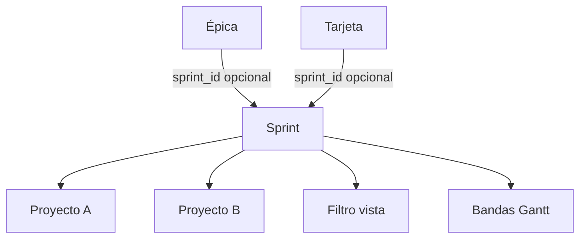
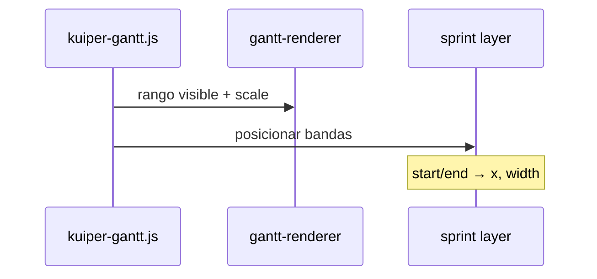

# Spec: sprints (planificación y filtrado)

**Alcance:** entidad **sprint** (fechas inicio/fin), relación con **varios proyectos**, asignación a **épicas y tarjetas** (una sprint activa por entidad), **filtro y agrupación** en tablero / calendario / Gantt, y **bandas de sprint** en la cabecera temporal del Gantt.

**Prerrequisitos:** [`kuiper-workspace-admin.md`](kuiper-workspace-admin.md), [`kuiper-board-ui.md`](kuiper-board-ui.md), [`kuiper-gantt-view.md`](kuiper-gantt-view.md), [`kuiper-calendar-view.md`](kuiper-calendar-view.md), [`kuiper-editor.md`](kuiper-editor.md).

**Código previsto:** migración `006_sprints.sql`, repos `sprints.js`, API, `kuiper-ui.js` (filtros, `groupBy`), `kuiper-gantt.js` (capa header), `core.js` (solapes de fechas), editor aside.

---

## 1. Objetivo

Los sprints agrupan trabajo en el tiempo (como iteraciones Scrum), pueden abarcar **más de un proyecto**, y sirven para:

1. **Filtrar** issues visibles en Board, Calendar y Gantt.
2. **Agrupar** swimlanes en el tablero Kanban (`groupBy: sprint`).
3. **Visualizar** el calendario de iteraciones en el **header del Gantt** como franjas sobre el eje de fechas.



---

## 2. Modelo de datos

### 2.1 Tabla `sprints`

| Columna | Tipo | Reglas |
| --- | --- | --- |
| `id` | TEXT PK | `entityId()` |
| `organization_id` | TEXT FK | Obligatorio |
| `name` | TEXT | Obligatorio |
| `slug` | TEXT | Único por org |
| `goal` | TEXT | Opcional (descripción corta) |
| `start_date` | TEXT | ISO `YYYY-MM-DD`, obligatorio |
| `end_date` | TEXT | ISO `YYYY-MM-DD`, obligatorio, `>= start_date` |
| `status` | TEXT | `planned` \| `active` \| `closed` (default `planned`) |
| `created_at`, `updated_at` | TEXT | ISO |

Índice: `(organization_id, start_date)`.

### 2.2 Tabla `sprint_projects` (N:M)

| Columna | Reglas |
| --- | --- |
| `sprint_id`, `project_id` | PK compuesta |

Un sprint debe tener **≥1 proyecto** al crear (validación API).

### 2.3 Asignación en épicas y tarjetas

| Tabla | Columna | Reglas |
| --- | --- | --- |
| `epics` | `sprint_id` | NULL o FK `sprints`; **máximo un sprint** por épica |
| `cards` | `sprint_id` | NULL o FK; **máximo un sprint** por tarjeta |

**Cambio de sprint:** PATCH `sprint_id` (o `null` para quitar). Historial opcional v1: evento `sprint_changed` en `card_events`.

**Independencia:** La sprint de una tarjeta **no** se infiere automáticamente de su épica en v1 (evita sorpresas). La UI puede ofrecer acción «Alinear con épica» en el editor.

### 2.4 Alcance en tablero

Un sprint solo aplica a tarjetas cuyo `project_id` esté en `sprint_projects` **y** en `board_projects` del tablero abierto. Asignar sprint a tarjeta de proyecto no incluido en el sprint → **400**.

---

## 3. API REST

Base: `/api/v1/organizations/:orgSlug/sprints` y `/api/v1/sprints/:id`.

| Método | Ruta | Comportamiento |
| --- | --- | --- |
| GET | `.../sprints` | Lista por org; query `?from=&to=` solape opcional |
| POST | `.../sprints` | Crear (`name`, `start_date`, `end_date`, `project_ids[]`, …) |
| GET | `/sprints/:id` | Detalle + `project_ids` |
| PATCH | `/sprints/:id` | Fechas, nombre, status, proyectos |
| DELETE | `/sprints/:id` | Pone `sprint_id` null en cards/epics afectadas |
| PATCH | `/cards/:id` | Campo `sprint_id` (ya en PATCH general) |
| PATCH | `/epics/:id` | Campo `sprint_id` |

`GET /boards/:slug/state` debe incluir:

- `sprints[]` relevantes (org + proyectos del tablero).
- En cada task: `sprintId` (nullable).
- En cada epic: `sprintId` (nullable).

---

## 4. UI — administración de sprints

Gestión en el sheet de [`kuiper-workspace-admin.md`](kuiper-workspace-admin.md) (pestaña **Sprints**).

### 4.1 Lista

1. Orden por `start_date` descendente (más reciente arriba).
2. Fila: nombre, rango fechas (`BoardCore` / locale), status, proyectos (chips), acciones editar/eliminar.
3. Sprint **activo** (`status === 'active'`): badge en lista.

### 4.2 Formulario crear/editar

| Campo | Control |
| --- | --- |
| Nombre | Input |
| Objetivo | Textarea opcional |
| Inicio / fin | `KuiperDateTimePicker.openDate` (sin scrim en sheet) |
| Proyectos | Multi-select (proyectos de la org) |
| Estado | Segmented `planned` / `active` / `closed` |

Validación inline si `end < start`.

### 4.3 Acciones rápidas

- «Marcar como sprint activo» → `status: active` (no exclusivo obligatorio en v1; puede haber varios `active`, pero UI avisa).

---

## 5. UI — asignación en editor

En aside del editor ([`kuiper-editor.md`](kuiper-editor.md)), después de Épica:

1. **Sprint** — dropdown searchable.
2. Opciones: sprints cuyo `sprint_projects` contiene el `project_id` de la tarjeta.
3. Opción «Sin sprint» (`null`).
4. Para épica (panel admin o editor épica futuro): mismo dropdown filtrado por proyecto de la épica.

---

## 6. Filtros (Board, Calendar, Gantt)

Paridad con filtros proyecto/épica ([`kuiper-board-ui.md`](kuiper-board-ui.md) KB-1).

### 6.1 Estado

| Pref | Tipo | Persistencia |
| --- | --- | --- |
| `sprintFilters` | `string[]` (ids) | `board.kuiper.prefs` + memoria sesión |

### 6.2 Menú Filtros

1. Nueva sección **Sprint** bajo épicas.
2. Multi-select; «Todos» limpia `sprintFilters`.
3. Badge cuenta en botón filtros incluye sprints.
4. Opción **Sin sprint** (`__none__`) para ver solo tarjetas/épicas sin asignar.

### 6.3 Regla de visibilidad (tarjeta)

Una tarjeta es visible si pasa filtros proyecto/épica/prioridad/flag **y**:

- `sprintFilters` vacío → sin filtro sprint.
- Si `__none__` ∈ filtros → incluir `!sprintId`.
- Si id sprint ∈ filtros → incluir `sprintId === id`.

(Solo `card.sprint_id`; no heredar de épica en filtro v1.)

### 6.4 Calendario

Misma función `visibleTasks()` / pipeline que board antes de pintar chips.

### 6.5 Gantt

Misma lista filtrada que alimenta filas; bandas de sprint en header son independientes del filtro (ver §7) pero solo se dibujan sprints que **solapan** el rango visible y tienen proyecto en el tablero.

---

## 7. Agrupación en tablero (`groupBy`)

| Valor nuevo | `groupBy: 'sprint'` |
| --- | --- |

1. Añadir opción en dropdown agrupación (rail).
2. Swimlane por sprint; clave `sprintId` o `__none__` («Sin sprint»).
3. Label: nombre sprint + fechas cortas.
4. Marca visual: barra color `--c` derivada de id sprint (paleta fija).
5. `defaultsForLane` al crear desde `+`: si lane es sprint, pre-rellenar `sprintId` en draft (no cambia proyecto).

Orden filas: sprint activo primero, luego por `start_date` desc, `__none__` al final.

---

## 8. Gantt — bandas en cabecera

### 8.1 Objetivo visual

En la **cabecera del timeline** (zona de días/semanas/meses), dibujar **franjas horizontales** por sprint como en herramientas tipo Jira Timeline / Azure DevOps:

```
┌────────────────────────────────────────────────────────┐
│ [Sprint 42 · 1–14 Mar]    [Sprint 43 · 15–28 Mar]     │  ← bandas
│  lun  mar  mié  jue  vie  sáb  dom  lun  mar  …       │  ← marcas zoom
└────────────────────────────────────────────────────────┘
```

### 8.2 Datos

Para cada sprint con al menos un `project_id` presente en el tablero:

- Calcular `[start_date, end_date]` en píxeles con la misma escala que el header (`gantt-renderer`).
- Recortar al viewport visible.

### 8.3 Capa DOM

1. Contenedor `kuiper-gantt-sprint-layer` **debajo** de marcas de día pero **encima** del fondo del header (z-index documentado en spec Gantt).
2. Cada banda: `kuiper-gantt-sprint-band` con `left`/`width` % o px; `title` accesible.
3. Color: fondo `color-mix(accent o paleta sprint, 12%)`; borde sutil `var(--line)`.
4. Texto truncado si la banda es estrecha; tooltip con nombre + rango completo.

### 8.4 Interacción

| Acción | Comportamiento |
| --- | --- |
| Clic banda | Aplicar filtro sprint único (toggle si ya activo) |
| Hover | Resaltar issues de ese sprint en lista (opcional v1.1) |

### 8.5 Solapes

Si dos sprints se solapan en fechas: dos filas de bandas (`row 0`, `row 1`) en el header; altura extra del header = `nRows * bandHeight` (máx. 3 filas; luego fusionar label en tooltip only).

### 8.6 Zoom

Recalcular en cambio de `scale` (día/semana/mes) y en scroll horizontal (`syncSprintBands`).



---

## 9. Lógica pura (`core.js`)

Funciones testeables:

| Función | Uso |
| --- | --- |
| `datesOverlap(aStart, aEnd, bStart, bEnd)` | Banda visible |
| `sprintOverlapsRange(sprint, viewStart, viewEnd)` | Filtrar bandas header |
| `sortSprintsForUi(list)` | Orden swimlanes |

Tests en `tests/core.test.js`.

---

## 10. Edge cases

| Caso | Comportamiento |
| --- | --- |
| Sprint sin proyectos del tablero | No banda en Gantt; no en dropdown editor de tarjetas del tablero |
| Tarjeta fuera de fechas del sprint asignado | **Permitido** v1 (solo aviso opcional en editor) |
| Cerrar sprint (`closed`) | Sigue visible en filtros históricos |
| Eliminar sprint | `sprint_id` → null en cards/epics |
| Cambiar fechas sprint | No mueve `schedule_*` de tarjetas |
| Filtro sprint + groupBy sprint | Redundante pero válido |

---

## 11. i18n

Claves: `sprint`, `sprints`, `sprintNone`, `sprintActive`, `sprintStart`, `sprintEnd`, `sprintGoal`, `groupSprint`, `filterSprint`, `sprintAlignEpic` (opcional).

---

## 12. Pruebas (fase implementación)

| Requisito | Test |
| --- | --- |
| Crear sprint con 2 proyectos | API |
| Asignar sprint a tarjeta proyecto inválido | API 400 |
| `datesOverlap` bordes mismo día | `core.test.js` |
| Filtro sprint reduce lista | `tests/core.test.js` o UI test manual |
| DELETE sprint limpia FKs | db test |

---

## 13. Fases de entrega

1. Migración + API + `state` con sprints.
2. Admin UI + editor `sprint_id`.
3. Filtros en las tres vistas.
4. `groupBy: sprint`.
5. Bandas Gantt header.

---

## 14. Deuda conocida

- Capacidad / burndown.
- Exclusividad un solo sprint `active` por org.
- Herencia épica → tarjeta al crear issue.
- Sincronizar fechas sprint con fechas planificación (sugerencias IA).
