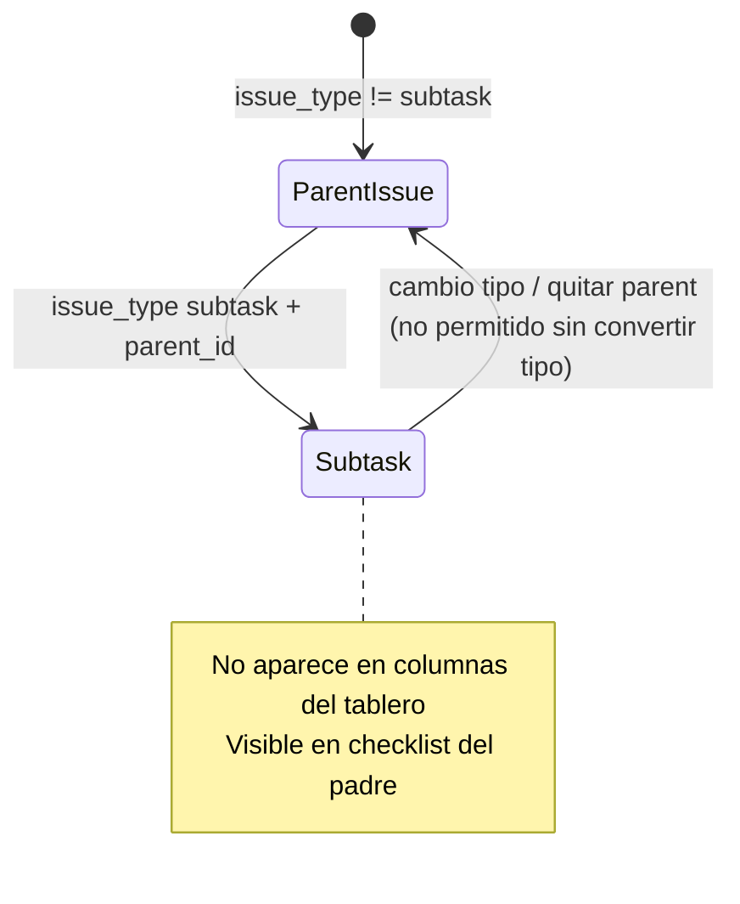

# Spec: subtareas (sub-task) en modo Kuiper

**Alcance:** jerarquía padre ↔ subtarea, exclusión del tablero Kanban, checklist en el editor del padre, herencia de contexto (proyecto, épica, sprint), impacto en filtros y vistas.

**Código previsto:** `server/issue-types.js`, `server/db/repositories/cards.js`, `server/board-view.js`, `core.js`, `kuiper-ui.js`, `kuiper-issue-panel.js`, `app.js` (`renderBoard`, `openEditor`), `kuiper-gantt.js`, `kuiper-calendar.js`, `tests/api.test.js`, `tests/core.test.js`.

**Relacionado:** [`kuiper-editor.md`](kuiper-editor.md), [`kuiper-board-ui.md`](kuiper-board-ui.md), [`kuiper-gantt-view.md`](kuiper-gantt-view.md), migración `007_issue_types.sql`.

**Diseño visual:** [`design-system.md`](../design-system.md) §11 (editor) y §10 (tarjeta).

---

## Estado actual (baseline)

| Capa | Comportamiento hoy |
| --- | --- |
| SQLite | `issue_type`, `parent_id` (FK `ON DELETE SET NULL`) |
| API | `parent_id` solo si `issue_type === 'subtask'`; padre no puede ser subtarea |
| API | **No** exige `parent_id` al crear subtarea |
| UI editor | Selector «Padre» visible solo si el tipo es subtarea |
| Tablero | Las subtareas se renderizan como tarjetas normales en columnas |
| Gantt | No usa `parentId` de la tarjeta; jerarquía solo swimlane/grupo |

**Objetivo:** modelo tipo Jira/Linear: la subtarea vive **dentro** del padre en la UI; el tablero solo muestra issues «de primer nivel».

---

## ST-1 Modelo de datos

**Entrada:** tarjeta con `issue_type` normalizado (`core.js` / `issue-types.js`).

**Salida:** invariantes de jerarquía.

| Regla | Detalle |
| --- | --- |
| ST-1.1 | Solo `issue_type === 'subtask'` puede tener `parent_id` no nulo |
| ST-1.2 | Si `issue_type === 'subtask'`, `parent_id` es **obligatorio** (crear y actualizar) |
| ST-1.3 | El padre debe ser del mismo `board_id` y `project_id`, no archivado, y `issue_type !== 'subtask'` |
| ST-1.4 | Profundidad máxima **1** (sin subtareas de subtareas) |
| ST-1.5 | Tipos permitidos como padre: `initiative`, `epic`, `story`, `task`, `bug`, `spike` (cualquier tipo salvo `subtask`) |

**Herencia de contexto** (valores que la subtarea **debe** compartir con el padre en todo momento):

- `project_id`
- `epic_id` (si el padre tiene épica; si el padre pierde épica, subtarea también)

**Sprint:** la subtarea puede tener `sprint_id` **distinto** del padre. Al cambiar el sprint del padre **no** se propagan subtareas; al crear una subtarea el sprint por defecto puede ser el del padre o vacío, pero es editable de forma independiente.

La subtarea conserva su propia fila en `cards` (mismo `stage_id`, `position`, notas, tiempo, tags, planificación, links).

---

## ST-2 API y persistencia

**Comportamiento:**

1. **Crear** (`POST /cards`): si `issue_type` es `subtask`, rechazar sin `parent_id` (`400`, mensaje claro). Tras resolver el padre, **copiar** `project_id` y `epic_id` del padre. `sprint_id`: si viene en el body, usarlo (validado); si no, por defecto el del padre.
2. **Actualizar** (`PATCH /cards/:id`):
   - Subtarea: no permitir `parent_id` nulo ni cambiar a tipo no-subtarea sin flujo explícito de «convertir a tarea» (fuera de alcance v1; bloquear o exigir `issue_type` distinto y limpiar `parent_id` en una sola operación).
   - Si se cambia `parent_id`, revalidar ST-1.3 y re-sincronizar herencia.
   - Si se actualiza el **padre** (`project_id` o `epic_id`), **propagar** esos valores a todas las subtareas activas (`archived = 0`) con `parent_id = id`. El `sprint_id` del padre **no** se propaga.
3. **Archivar padre:** archivar en cascada todas las subtareas hijas.
4. **Restaurar padre:** opcional v1 — restaurar hijas que se archivaron en la misma operación (mismo timestamp de evento); si es complejo, documentar «restaurar hijas manualmente» en v1.
5. **Detalle** (`GET /cards/:id/detail`): incluir `subtasks: CardSummary[]` ordenadas por `position` luego `created_at` (id, título, `stage_id`, `issue_type`, flags de progreso si aplica).

**Errores:**

| Código | Condición |
| --- | --- |
| 400 | Subtarea sin padre |
| 400 | Padre inválido, archivado, otro proyecto o es subtarea |
| 400 | `parent_id` en tipo no subtarea |

**Edge cases:**

- Padre archivado con hijas activas: impedir archivar padre sin cascada (cascada resuelve).
- `ON DELETE` del padre en DB: evitar huérfanas — preferir **no** borrar tarjetas; archivar en aplicación. Si hay DELETE API, rechazar si tiene subtareas o cascada-archivar hijas.
- Migración datos: subtareas existentes sin `parent_id` → listar en informe; UI las trata como `task` hasta corrección manual o script de migración (fuera de alcance salvo comando admin).

---

## ST-3 Tablero Kanban (visibilidad)

**Función canónica:** `BoardCore.isBoardTopLevelTask(task)` en `core.js`:

- Devuelve `false` si `normalizeIssueType(task.issueType) === 'subtask'` **o** `task.parentId` está definido.

**Comportamiento:**

1. `itemsInColumn`, swimlanes, contadores de columna/proyecto y drag-drop del tablero operan solo sobre issues de primer nivel.
2. Las subtareas **no** son destino válido de drop desde el tablero (no hay tarjeta).
3. Filtros del rail (`matchesVisible`): una subtarea **no** satisface visibilidad del tablero por sí sola; el padre sigue visible según filtros aunque ninguna subtarea coincida.
4. Filtro por tipo «Subtarea» en el rail: oculto o deshabilitado (no hay filas en tablero); opcional mantener filtro solo para informes/API.

**Tarjeta del padre (`.kuiper-card`):**

- Línea opcional de progreso de subtareas: `3/5` o barra fina si hay al menos una subtarea.
- No sustituye la barra de tiempo estimado existente.

---

## ST-4 Editor del padre — checklist de subtareas

**Ubicación:** pestaña **Subtareas** en `#kuiperIssueTabs` (junto a Comentarios / Tiempo / Historial); contenido en `#kuiperSubtasksPanel`.

**Comportamiento:**

| ID | Requisito |
| --- | --- |
| ST-4.1 | Solo visible si la issue editada **no** es subtarea y no es `editing === 'new'` sin guardar (tras primer guardado, mostrar bloque vacío con CTA). |
| ST-4.2 | Lista de filas: checkbox + **pista** unificada (título + selector de etapa en un mismo bloque con separador, estilo enlaces). |
| ST-4.3 | Checkbox **hecho** → etapa **terminal** (última por `order`); el selector muestra esa etapa (p. ej. Done). Al desmarcar, restaurar la **etapa que tenía antes de marcar** (memoria en cliente por sesión). Selector de fase: mismo control desplegable Kuiper que el aside; cambio manual de etapa vía `PATCH` `stage_id` y actualiza la memoria de restauración. |
| ST-4.4 | Título editable en línea (`PATCH` `title` al salir del campo / Enter). Botón **Abrir** (chevron) abre el editor de la subtarea. |
| ST-4.5 | Fila inferior «Añadir subtarea»: input inline; `Enter` crea subtarea (`POST` con `issue_type: subtask`, `parent_id`, título, herencia). Foco permanece en input para entrada rápida tipo checklist. |
| ST-4.6 | Reordenar subtareas (drag handle opcional v2); v1 orden por `position` al crear (append al final del grupo padre). |
| ST-4.7 | Menú fila (⋯): abrir, archivar (quita de lista). |

**Vacío:** mensaje breve + mismo input «Añadir subtarea».

**i18n:** claves nuevas `subtasks`, `addSubtask`, `subtaskProgress` (es/en en `i18n.js`).

---

## ST-5 Editor de subtarea

**Comportamiento:**

1. Cabecera: enlace «Padre · {id}» → abre editor del padre con la pestaña **Subtareas** activa.
2. Aside:
   - **Tipo:** `subtask` (cambiar a otro tipo exige confirmación y limpia jerarquía — v1 puede bloquear cambio de tipo).
   - **Proyecto, épica, sprint:** controles **solo lectura**, mostrando valores del padre (recargar si el padre cambió).
   - **Padre:** selector reemplazado por lectura del padre actual; cambio de padre v1 solo desde menú avanzado o no permitido.
   - **Etapa, prioridad, flag:** editables (etapa alimenta checkbox en padre).
3. Área principal: título y notas como issue normal; panel colaboración (tags, tiempo, links) permitido.
4. **No** mostrar bloque checklist de subtareas (las subtareas no anidan hijas en v1).

**Crear subtarea sin pasar por padre** (usuario elige tipo Subtarea en editor):

- Exigir padre en selector (comportamiento actual mejorado) + validación API ST-2.
- Tras guardar, no aparece en tablero; aparece en checklist del padre.

**Crear desde `+` columna:** no ofrecer tipo subtarea en el menú de creación rápida (solo desde padre o tipo explícito en editor con padre obligatorio).

---

## ST-6 Vistas Calendario y Gantt

| Vista | Comportamiento |
| --- | --- |
| Calendario | Excluir subtareas de eventos de día salvo que en v2 se decida «mostrar con prefijo del padre». **v1:** no aparecen en calendario (misma regla `isBoardTopLevelTask`). |
| Gantt | Excluir subtareas de filas raíz. Si la subtarea tiene `schedule_start` / `schedule_end`, mostrarla como **hija** de la fila del padre (`pushCardTask(..., parentNum)` usando `parentId`). Si el padre no está en Gantt (filtrado), colgar de la fila de grupo swimlane o omitir barra hasta que el padre sea visible. |

Actualizar nota en [`kuiper-gantt-view.md`](kuiper-gantt-view.md): jerarquía issue puede incluir subtareas bajo el padre además de proyecto/épica.

---

## ST-7 Búsquedas, links y URL

1. Sugerencias de **linked issues** pueden incluir subtareas (son tarjetas reales).
2. Búsqueda global / filtro texto en tablero: coincidencia en subtarea **no** muestra la subtarea en columna; opcional resaltar padre (v2). **v1:** sin resaltado; solo búsqueda en issues de primer nivel.
3. `?card=<subtask-id>` abre editor de la subtarea (deep link válido).

---

## ST-8 Sincronización cliente (`state.tasks`)

Tras `refreshKuiperBoard` / carga inicial:

- Mantener **todas** las tarjetas en `state.tasks` (incluidas subtareas) para checklist y Gantt.
- Helpers en `KuiperUI`:
  - `subtasksOf(parentId)`
  - `isSubtask(task)`
  - `subtaskDone(task, columns)` — compara `columnId` con etapa terminal.

---

## Plan de pruebas (TDD)

| Requisito | Test |
| --- | --- |
| ST-1.2 API | `api.test.js`: POST subtask sin `parent_id` → error |
| ST-2 herencia | POST subtask con `project_id` distinto al padre → respuesta usa proyecto del padre |
| ST-2 propagación | PATCH padre `sprint_id` → hijas actualizadas |
| ST-3 core | `core.test.js`: `isBoardTopLevelTask` false para subtask |
| ST-3 contadores | `core.test.js` o `api.test.js`: snapshot state no cuenta subtareas en posiciones de columna del padre (si la lógica vive en servidor, test de `board-view` opcional) |
| ST-4 checkbox | DOM o test de módulo: toggle checkbox dispara `stage_id` terminal / primera |

---

## Fuera de alcance (v1)

- Subtareas anidadas (profundidad > 1).
- Convertir subtarea ↔ tarea con un solo clic.
- Etapas «Done» configurables por tablero (usar última etapa por orden).
- Modo clásico (`localStorage`); solo Kuiper.

---

## Criterios de aceptación (resumen)

1. No existe tarjeta de subtarea en columnas del tablero.
2. Toda subtarea tiene padre válido en API.
3. Desde el padre se pueden añadir subtareas con título y marcarlas hechas con checkbox.
4. Al abrir una subtarea, proyecto/épica/sprint coinciden con el padre y no son editables.
5. Tests anteriores en verde.
