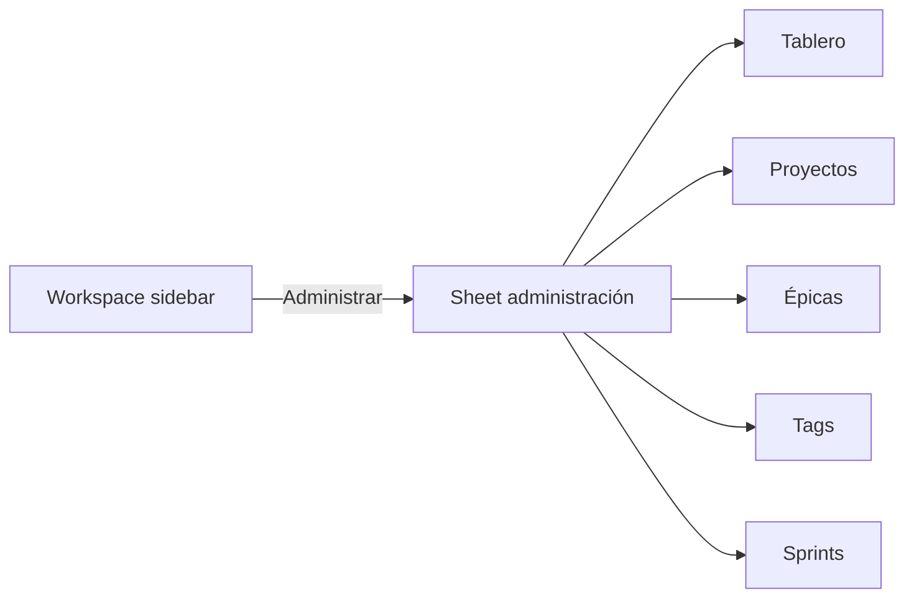

# Spec: administración del workspace (UI Kuiper)

**Alcance:** alta y gestión en la app de **organización (contexto actual)**, **tableros**, **proyectos**, **vínculo tablero↔proyecto**, **etapas**, **épicas** y **tags** del tablero activo.

**Fuera de alcance v1:** multi-usuario, permisos por rol, borrado de organización con asistente legal, sustituir el CLI (el CLI sigue siendo válido para automatización y MCP).

**Relacionado:** [`kuiper-platform.md`](kuiper-platform.md), [`kuiper-board-ui.md`](kuiper-board-ui.md), [`kuiper-editor.md`](kuiper-editor.md), [`kuiper-sprints.md`](kuiper-sprints.md), [`design-system.md`](../design-system.md).

**Código previsto:** `kuiper-workspace-admin.js` (o módulo dentro de `kuiper-ui.js` si se mantiene acotado), ampliación de `kuiper-store.js`, `server/api/router.js`, repos en `server/db/repositories/`, migración SQL.

---

## 1. Objetivo

Hoy el panel **Workspace** (`#kuiperSide`) es solo **navegación y filtros**; crear entidades exige CLI (`org`, `board`, `project`, `epic`, …). Se necesita una **UI de administración** integrada, coherente con el design system, para dar de alta y mantener la estructura del trabajo sin salir del tablero.

```mermaid
flowchart TB
  subgraph today [Hoy]
    WS[Workspace sidebar]
    WS --> Nav[Navegar tableros]
    WS --> Fil[Filtros proyecto/épica]
    CLI[CLI / MCP] --> DB[(SQLite)]
  end
  subgraph target [Objetivo]
    WS2[Workspace + Administrar]
    WS2 --> Nav2[Navegar]
    WS2 --> Adm[CRUD entidades]
    Adm --> API[/api/v1/admin o rutas REST]
    API --> DB2[(SQLite)]
  end
```

---

## 2. Entrada y contexto

| Propiedad | Valor |
| --- | --- |
| Modo | Solo `?kuiper=1` con API local (`kanban serve`) |
| Org activa | Query `org=<slug>` (como hoy) |
| Tablero activo | Query `board=<slug>` |
| Permisos v1 | Implícito “admin local”; sin auth |

**Errores:** sin org/tablero en URL → no mostrar acciones de escritura; mensaje `workspaceAdminNeedsBoard` (i18n).

---

## 3. Modelo de datos (existente + extensiones UI)

Entidades ya en SQLite (`001_initial.sql`, `004_card_collaboration.sql`):

| Entidad | Notas |
| --- | --- |
| `organizations` | slug, name |
| `projects` | por org; `code` (2–4 chars) para IDs tarjeta |
| `boards` | por org; slug |
| `board_projects` | N:M tablero ↔ proyectos visibles en el tablero |
| `board_stages` | columnas del tablero; `position`, `name` |
| `epics` | por `project_id`; status `planned`… |
| `tags` | por `board_id`; nombre único case-insensitive |
| `cards` | `project_id`, `epic_id`, `stage_id` |

**Extensiones mínimas para admin UI (migración aparte si faltan en DB):**

| Campo / tabla | Uso |
| --- | --- |
| `projects.color` | Color entidad (paridad modo clásico); opcional hex/token |
| `epics.color` | Opcional; si null, paleta por índice (como UI actual) |

No duplicar lógica de `code` de proyecto: asignación automática vía repo existente al crear.

---

## 4. API REST (nueva superficie)

Ampliar `/api/v1` (JSON, mismos CORS que hoy). Patrón: validar org/tablero por slug; errores `404` / `409` (slug duplicado) / `400`.

### 4.1 Organización (contexto)

| Método | Ruta | Comportamiento |
| --- | --- | --- |
| GET | `/organizations/:orgSlug` | Detalle org |
| PATCH | `/organizations/:orgSlug` | Renombrar (`name`); no cambiar `slug` en v1 |

### 4.2 Proyectos (org)

| Método | Ruta | Comportamiento |
| --- | --- | --- |
| GET | `/organizations/:orgSlug/projects` | Lista |
| POST | `/organizations/:orgSlug/projects` | Crear (`name`, `slug?`, `description?`) |
| PATCH | `/projects/:id` | `name`, `description`, `color` |
| DELETE | `/projects/:id` | Solo si sin tarjetas o con `force` + reglas (ver §7) |

### 4.3 Tableros (org)

| Método | Ruta | Comportamiento |
| --- | --- | --- |
| GET | `/organizations/:orgSlug/boards` | Lista |
| POST | `/organizations/:orgSlug/boards` | Crear (`name`, `slug?`, `stage_names?` default Backlog/Doing/Done) |
| PATCH | `/boards/:id` | `name` |
| DELETE | `/boards/:id` | v1: prohibido si tiene tarjetas |

### 4.4 Tablero activo — proyectos y etapas

| Método | Ruta | Comportamiento |
| --- | --- | --- |
| GET | `/boards/:slug/membership` | Proyectos enlazados + etapas ordenadas |
| POST | `/boards/:slug/projects` | Enlazar `project_id` |
| DELETE | `/boards/:slug/projects/:projectId` | Desenlazar (no borrar proyecto org) |
| POST | `/boards/:slug/stages` | Nueva etapa al final |
| PATCH | `/boards/:slug/stages/:id` | Renombrar |
| PATCH | `/boards/:slug/stages/reorder` | Body `{ order: [stage_id, …] }` |
| DELETE | `/boards/:slug/stages/:id` | Solo si columna vacía |

### 4.5 Épicas

| Método | Ruta | Comportamiento |
| --- | --- | --- |
| GET | `/projects/:projectId/epics` | Lista |
| POST | `/projects/:projectId/epics` | Crear |
| PATCH | `/epics/:id` | `title`, `description`, `status`, `color` |
| DELETE | `/epics/:id` | Desasignar tarjetas (`epic_id` null) |

### 4.6 Tags (tablero)

| Método | Ruta | Comportamiento |
| --- | --- | --- |
| GET | `/boards/:slug/tags` | Ya existe |
| POST | `/boards/:slug/tags` | Crear por nombre |
| PATCH | `/tags/:id` | Renombrar (propagar nombre en UI; IDs estables) |
| DELETE | `/tags/:id` | Quitar de tarjetas (`card_tags`) |

Tras mutaciones que afecten al tablero abierto: respuesta incluye `board_version` o el cliente llama `refreshKuiperBoard()` / `loadNavigation()`.

---

## 5. UI — ubicación y navegación

### 5.1 Punto de entrada

1. En `#kuiperSide`, pie fijo o sección **«Administrar»** (`workspaceManage`).
2. Abre **sheet** ancho `min(720px, 100vw - 28px)` — mismo patrón que `#editor` / paneles en [`design-system.md`](../design-system.md).
3. Cabecera: título + pestañas internas (no confundir con vistas Board/Calendar/Gantt).

### 5.2 Pestañas del sheet

| Pestaña | Contenido |
| --- | --- |
| **Tablero** | Nombre tablero; etapas (reordenar, renombrar, añadir); proyectos enlazados al tablero |
| **Proyectos** | Todos los de la org; crear; color; código readonly; contador tarjetas |
| **Épicas** | Selector de proyecto → lista épicas; crear/editar/archivar |
| **Tags** | Tags del tablero actual; crear, renombrar, eliminar |
| **Sprints** | Enlace a flujo de [`kuiper-sprints.md`](kuiper-sprints.md) (misma shell o subpestaña) |



### 5.3 Patrones de componente

| Patrón | Referencia |
| --- | --- |
| Filas editables | Inspiración `.prow` modo clásico (`app.js` `renderProjects`) |
| Listas scroll | `.kuiper-scroll` |
| Confirmación destructiva | Toast + undo cuando aplique; `confirm()` solo en delete irreversible |
| Slug | Auto desde nombre; editable avanzado colapsable |
| Vacío | Hint + CTA primario «Crear …» |

### 5.4 Tablero — etapas

1. Lista vertical ordenada; asa drag para reordenar (actualiza `position`).
2. Inline rename on blur.
3. `+ Etapa` al final.
4. No eliminar etapa con tarjetas (deshabilitar + tooltip).

### 5.5 Tablero — proyectos en tablero

1. Checkbox o toggle por proyecto de la org.
2. Al menos un proyecto enlazado si el tablero tiene tarjetas (validación).
3. Crear proyecto rápido desde aquí (POST org) y auto-enlazar.

### 5.6 Proyectos (org)

1. Fila: color, nombre, slug/código, nº tarjetas, eliminar.
2. Paleta de color = `COLORS` / tokens existentes.
3. Eliminar: si hay tarjetas, ofrecer «desvincular tarjetas» (bloquear v1) o impedir delete.

### 5.7 Épicas

1. Dropdown proyecto (proyectos de la org).
2. Lista: título, status, nº issues, editar en línea o mini-form.
3. Status: `planned` | `in_progress` | `done` (alinear con CLI si difiere).

### 5.8 Tags

1. Chips en grid o lista; nombre único.
2. Renombrar no rompe `card_tags` (ID estable).
3. Vista previa color hash como en tarjetas.

---

## 6. Comportamiento tras cambios

| Evento | UI |
| --- | --- |
| Crear tablero | Ofrecer «Abrir tablero» → `navigateToBoard` |
| Enlazar proyecto | Refrescar `state.projects` del tablero |
| Reordenar etapas | Refrescar columnas sin perder scroll board si posible |
| Crear tag | Disponible en autocompletado del editor al instante |

---

## 7. Edge cases y errores

| Caso | Comportamiento |
| --- | --- |
| Slug duplicado | 409; mensaje inline |
| Última etapa | No eliminar |
| Desenlazar proyecto con tarjetas | Bloquear o exigir mover tarjetas (v1: **bloquear**) |
| API caída | Toast `workspaceAdminFailed`; sheet en solo lectura |
| Usuario en vista Gantt/Calendar | Mismas reglas de refresh de `state.tasks` |

---

## 8. i18n

Claves nuevas bajo prefijo `workspaceAdmin*` y reutilizar `projects`, `boards`, `epic`, `tags` donde existan.

---

## 9. Pruebas (fase implementación)

| Requisito | Test |
| --- | --- |
| POST proyecto | `tests/api.test.js` |
| Enlazar proyecto a tablero | `tests/api.test.js` |
| Reorden etapas | `tests/db.test.js` o API |
| Tag rename conserva asociaciones | `tests/db.test.js` |
| Slug inválido | API 400 |

---

## 10. Fases de entrega sugeridas

1. **API** proyectos + membership + etapas + refresh navegación.
2. **UI** pestañas Tablero + Proyectos.
3. **Épicas + tags** API/UI.
4. **Sprints** (spec dedicada).

---

## 11. Deuda conocida

- RBAC y auditoría.
- Editar `slug` de tablero/proyecto con redirección URL.
- Import/export workspace completo.
